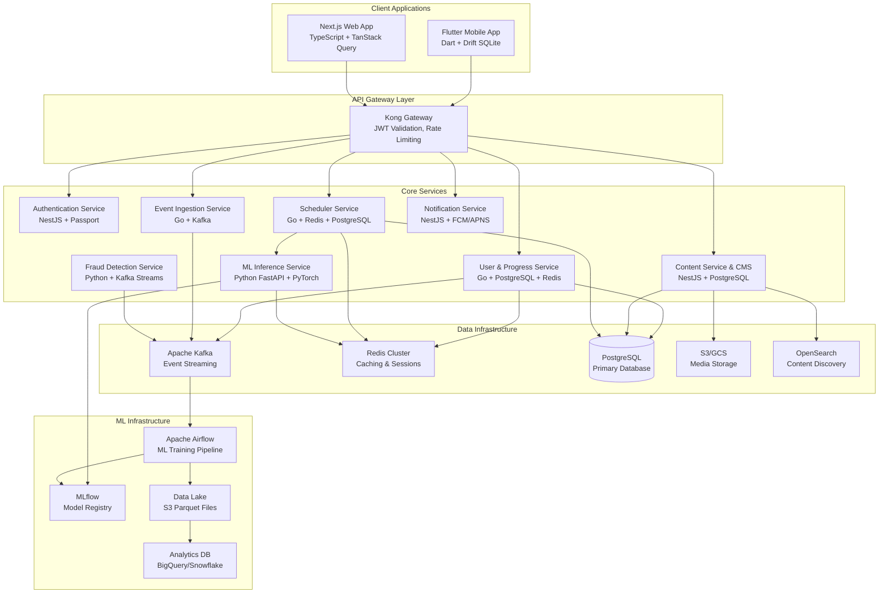

# Design Document

## Overview

The Adaptive Learning Platform is architected as a cloud-native, microservices-based system designed for global scale and high availability. The platform combines cutting-edge machine learning algorithms with production-grade infrastructure to deliver personalized driving test preparation. The system follows Domain-Driven Design principles with clear service boundaries, event-driven architecture for loose coupling, and CQRS patterns where appropriate for read/write optimization.

### Key Design Principles

1. **Offline-First Mobile Experience**: Flutter clients operate independently with full functionality, syncing when connectivity allows
2. **Microservices with Clear Boundaries**: Each service owns its domain data and exposes well-defined interfaces
3. **Event-Driven Architecture**: Services communicate asynchronously via Kafka for scalability and resilience
4. **Machine Learning at Scale**: ML models are versioned, A/B tested, and deployed with proper MLOps practices
5. **Security by Design**: Zero-trust architecture with encryption everywhere and comprehensive audit trails
6. **Performance-First**: Sub-300ms response times for critical paths with intelligent caching strategies

## Architecture

### High-Level System Architecture



### Service Communication Patterns

**Synchronous Communication (gRPC)**

- Internal service-to-service calls for real-time operations
- Type-safe Protocol Buffer definitions
- Circuit breakers and retries with exponential backoff
- Distributed tracing with OpenTelemetry

**Asynchronous Communication (Kafka)**

- Event publishing for state changes and user actions
- Event sourcing for audit trails and replay capabilities
- Consumer groups for parallel processing
- Dead letter queues for error handling

**Client Communication (REST/GraphQL)**

- RESTful APIs for CRUD operations
- GraphQL for complex queries (future consideration)
- WebSocket connections for real-time updates
- Server-Sent Events for progress notifications

## Components and Interfaces

### 1. Authentication Service (NestJS)

**Responsibilities:**

- OAuth 2.0/OIDC integration with multiple providers
- JWT token generation and validation
- Refresh token rotation and management
- Multi-factor authentication support
- Account lockout and security policies

**Key Interfaces:**

```typescript
interface AuthService {
  // OAuth flow initiation
  initiateOAuth(provider: string, redirectUri: string): Promise<AuthUrl>;

  // Token exchange
  exchangeCode(code: string, state: string): Promise<TokenPair>;

  // Token operations
  validateToken(token: string): Promise<UserClaims>;
  refreshToken(refreshToken: string): Promise<TokenPair>;
  revokeToken(token: string): Promise<void>;

  // MFA operations
  enableMFA(userId: string): Promise<MFASetup>;
  verifyMFA(userId: string, code: string): Promise<boolean>;
}
```

**Data Models:**

```sql
-- Users table (shared with User Service)
CREATE TABLE users (
    id UUID PRIMARY KEY DEFAULT gen_random_uuid(),
    email VARCHAR(255) UNIQUE NOT NULL,
    email_verified BOOLEAN DEFAULT FALSE,
    hashed_password VARCHAR(255), -- NULL for OAuth-only users
    country_code VARCHAR(2) NOT NULL,
    preferences JSONB DEFAULT '{}',
    mfa_enabled BOOLEAN DEFAULT FALSE,
    mfa_secret VARCHAR(255),
    failed_login_attempts INTEGER DEFAULT 0,
    locked_until TIMESTAMPTZ,
    created_at TIMESTAMPTZ DEFAULT NOW(),
    updated_at TIMESTAMPTZ DEFAULT NOW(),
    last_active_at TIMESTAMPTZ DEFAULT NOW(),
    is_active BOOLEAN DEFAULT TRUE
);

-- OAuth providers
CREATE TABLE oauth_providers (
    id UUID PRIMARY KEY DEFAULT gen_random_uuid(),
    user_id UUID REFERENCES users(id) ON DELETE CASCADE,
    provider VARCHAR(50) NOT NULL,
    provider_user_id VARCHAR(255) NOT NULL,
    access_token_hash VARCHAR(255),
    refresh_token_hash VARCHAR(255),
    expires_at TIMESTAMPTZ,
    created_at TIMESTAMPTZ DEFAULT NOW(),
    UNIQUE(provider, provider_user_id)
);

-- Refresh tokens
CREATE TABLE refresh_tokens (
    id UUID PRIMARY KEY DEFAULT gen_random_uuid(),
    user_id UUID REFERENCES users(id) ON DELETE CASCADE,
    token_hash VARCHAR(255) UNIQUE NOT NULL,
    expires_at TIMESTAMPTZ NOT NULL,
    revoked BOOLEAN DEFAULT FALSE,
    created_at TIMESTAMPTZ DEFAULT NOW()
);
```

### 2. User & Progress Service (Go)

**Responsibilities:**

- User profile management and preferences
- Learning progress tracking and analytics
- Scheduler state persistence and caching
- Skill mastery calculations and updates
- User activity event publishing

**Key Interfaces:**

```go
type UserService interface {
    // User management
    GetUser(ctx context.Context, userID string) (*User, error)
    UpdateUser(ctx context.Context, userID string, updates *UserUpdates) error
    GetUserPreferences(ctx context.Context, userID string) (*Preferences, error)
    UpdatePreferences(ctx context.Context, userID string, prefs *Preferences) error

    // Progress tracking
    GetMastery(ctx context.Context, userID string, topics []string) (map[string]float64, error)
    UpdateMastery(ctx context.Context, userID string, topic string, mastery float64) error
    GetProgressSummary(ctx context.Context, userID string) (*ProgressSummary, error)

    // Scheduler state
    GetSchedulerState(ctx context.Context, userID string) (*SchedulerState, error)
    UpdateSchedulerState(ctx context.Context, userID string, state *SchedulerState) error

    // Activity tracking
    RecordActivity(ctx context.Context, activity *UserActivity) error
}
```

**Caching Strategy:**

- Redis keys: `user:{userID}`, `mastery:{userID}`, `scheduler:{userID}`
- TTL: 1 hour for user data, 30 minutes for mastery, 15 minutes for scheduler state
- Write-through caching with background refresh
- Cache warming for active users

### 3. Content Service & CMS (NestJS)

**Responsibilities:**

- Content creation, editing, and approval workflows
- Media asset management and CDN integration
- Content versioning and audit trails
- Search and discovery functionality
- Bulk import/export capabilities

**Key Interfaces:**

```typescript
interface ContentService {
  // Content CRUD
  createItem(item: CreateItemDto): Promise<Item>
  updateItem(id: string, updates: UpdateItemDto): Promise<Item>
  getItem(id: string): Promise<Item>
  queryItems(filters: ItemFilters): Promise<PaginatedItems></PaginatedItems>leteItem(id: string): Promise<void>

  // Workflow management
  submitForReview(id: string): Promise<void>
  approveItem(id: string, reviewerId: string): Promise<void>
  rejectItem(id: string, reason: string): Promise<void>
  publishItem(id: string): Promise<void>

  // Media management
  uploadMedia(file: Buffer, metadata: MediaMetadata): Promise<MediaReference>
  getSignedUrl(mediaId: string, expiresIn: number): Promise<string>

  // Bulk operations
  bulkImport(data: ItemImportData[]): Promise<ImportResult>
  bulkExport(filters: ItemFilters): Promise<ExportResult>
}
```

### 4. Scheduler Service (Go)

**Responsibilities:**

- Next-item selection using unified scoring algorithm
- SM-2 spaced repetition implementation
- Bayesian Knowledge Tracing per topic
- IRT ability estimation and updates
- Contextual bandit for strategy selection
- Session planning and constraint enforcement

**Key Interfaces:**

```go
type SchedulerService interface {
    // Item selection
    GetNextItems(ctx context.Context, req *NextItemsRequest) (*NextItemsResponse, error)
    GetPlacementItems(ctx context.Context, req *PlacementRequest) (*PlacementResponse, error)

    // Attempt processing
    RecordAttempt(ctx context.Context, attempt *AttemptRecord) (*AttemptResponse, error)

    // State management
    InitializeUser(ctx context.Context, userID string, placementResults *PlacementResults) error
    GetUserState(ctx context.Context, userID string) (*UserSchedulerState, error)

    // Analytics
    GetItemDifficulty(ctx context.Context, itemID string) (float64, error)
    GetTopicMastery(ctx context.Context, userID string, topic string) (float64, error)
}
```

**Algorithm Implementations:**

**SM-2 Algorithm:**

```go
type SM2State struct {
    EasinessFactor float64   `json:"easiness_factor"`
    Interval       int       `json:"interval"`
    Repetition     int       `json:"repetition"`
    NextDue        time.Time `json:"next_due"`
    LastReviewed   time.Time `json:"last_reviewed"`
}

func (s *SM2State) Update(quality int) {
    // Update easiness factor
    s.EasinessFactor = math.Max(1.3,
        s.EasinessFactor + 0.1 - (5-quality)*(0.08+(5-quality)*0.02))

    if quality < 3 {
        // Reset for poor performance
        s.Interval = 1
        s.Repetition = 0
    } else {
        s.Repetition++
        switch s.Repetition {
        case 1:
            s.Interval = 1
        case 2:
            s.Interval = 6
        default:
            s.Interval = int(float64(s.Interval) * s.EasinessFactor)
        }
    }

    s.NextDue = time.Now().AddDate(0, 0, s.Interval)
    s.LastReviewed = time.Now()
}
```

**Bayesian Knowledge Tracing:**

```go
type BKTState struct {
    ProbKnowledge float64 `json:"prob_knowledge"` // P(L)
    ProbGuess     float64 `json:"prob_guess"`     // P(G)
    ProbSlip      float64 `json:"prob_slip"`      // P(S)
    ProbLearn     float64 `json:"prob_learn"`     // P(T)
}

func (b *BKTState) UpdateOnAttempt(correct bool) {
    if correct {
        // P(correct) = P(L) * (1 - P(S)) + (1 - P(L)) * P(G)
        probCorrect := b.ProbKnowledge*(1-b.ProbSlip) + (1-b.ProbKnowledge)*b.ProbGuess
        // Update P(L) using Bayes rule
        b.ProbKnowledge = (b.ProbKnowledge * (1 - b.ProbSlip)) / probCorrect
    } else {
        // P(incorrect) = P(L) * P(S) + (1 - P(L)) * (1 - P(G))
        probIncorrect := b.ProbKnowledge*b.ProbSlip + (1-b.ProbKnowledge)*(1-b.ProbGuess)
        b.ProbKnowledge = (b.ProbKnowledge * b.ProbSlip) / probIncorrect
    }

    // Apply learning
    b.ProbKnowledge = b.ProbKnowledge + (1-b.ProbKnowledge)*b.ProbLearn
}
```

**Unified Scoring Function:**

```go
func (s *SchedulerService) computeUnifiedScore(
    item *Item,
    userState *UserSchedulerState,
    sessionContext *SessionContext,
) float64 {
    var score float64

    // SM-2 due urgency component
    sm2State := userState.SM2States[item.ID]
    daysSinceDue := time.Since(sm2State.NextDue).Hours() / 24
    urgencyScore := sigmoid(daysSinceDue, 0, 2) // sigmoid centered at due date

    // BKT mastery gap component
    var masteryGap float64
    for _, topic := range item.Topics {
        bktState := userState.BKTStates[topic]
        masteryGap += (1 - bktState.ProbKnowledge)
    }
    masteryGap /= float64(len(item.Topics))

    // IRT difficulty matching component
    var difficultyMatch float64
    for _, topic := range item.Topics {
        theta := userState.AbilityVector[topic]
        // Optimal challenge when P(correct) ≈ 0.75
        probCorrect := irt1PL(theta, item.Difficulty)
        difficultyMatch += gaussian(probCorrect, 0.75, 0.1)
    }
    difficultyMatch /= float64(len(item.Topics))

    // Contextual bandit exploration bonus
    explorationBonus := s.bandit.GetExplorationBonus(item, sessionContext)

    // Weighted combination
    score = s.config.WeightUrgency*urgencyScore +
            s.config.WeightMastery*masteryGap +
            s.config.WeightDifficulty*difficultyMatch +
            s.config.WeightExploration*explorationBonus

    return score
}
```

### 5. ML Inference Service (Python FastAPI)

**Responsibilities:**

- Deep Knowledge Tracing model serving
- Model versioning and A/B testing
- Batch prediction processing
- Feature engineering for real-time inference
- Model explainability and insights

**Key Interfaces:**

```python
from fastapi import FastAPI
from pydantic import BaseModel
from typing import List, Dict, Optional

class PredictionRequest(BaseModel):
    user_id: str
    attempt_history: List[AttemptRecord]
    candidate_items: List[str]
    context: Dict[str, Any]

class PredictionResponse(BaseModel):
    predictions: Dict[str, float]  # item_id -> probability
    confidence_scores: Dict[str, float]
    feature_importance: Optional[Dict[str, float]]
    model_version: str

class MLInferenceService:
    async def predict_batch(
        self,
        requests: List[PredictionRequest]
    ) -> List[PredictionResponse]:
        """Batch prediction for efficiency"""
        pass

    async def predict_single(
        self,
        request: PredictionRequest
    ) -> PredictionResponse:
        """Single prediction with caching"""
        pass

    async def explain_prediction(
        self,
        user_id: str,
        item_id: str
    ) -> Dict[str, float]:
        """SHAP feature importance"""
        pass
```

**DKT Model Architecture:**

```python
import torch
import torch.nn as nn

class DKTModel(nn.Module):
    def __init__(self, num_items, num_topics, hidden_size=128, num_layers=2):
        super().__init__()
        self.num_items = num_items
        self.num_topics = num_topics
        self.hidden_size = hidden_size

        # Embeddings
        self.item_embedding = nn.Embedding(num_items, hidden_size // 2)
        self.topic_embedding = nn.Embedding(num_topics, hidden_size // 2)
        self.response_embedding = nn.Embedding(2, hidden_size // 4)  # correct/incorrect

        # LSTM layers
        self.lstm = nn.LSTM(
            input_size=hidden_size + hidden_size // 4,
            hidden_size=hidden_size,
            num_layers=num_layers,
            batch_first=True,
            dropout=0.2
        )

        # Output layers
        self.prediction_head = nn.Linear(hidden_size, 1)
        self.mastery_head = nn.Linear(hidden_size, num_topics)

    def forward(self, item_ids, topic_ids, responses, lengths):
        batch_size, seq_len = item_ids.shape

        # Embeddings
        item_emb = self.item_embedding(item_ids)
        topic_emb = self.topic_embedding(topic_ids)
        response_emb = self.response_embedding(responses)

        # Concatenate features
        features = torch.cat([item_emb, topic_emb, response_emb], dim=-1)

        # LSTM forward pass
        packed_input = nn.utils.rnn.pack_padded_sequence(
            features, lengths, batch_first=True, enforce_sorted=False
        )
        packed_output, (hidden, cell) = self.lstm(packed_input)
        output, _ = nn.utils.rnn.pad_packed_sequence(packed_output, batch_first=True)

        # Predictions
        next_correct_prob = torch.sigmoid(self.prediction_head(output))
        topic_mastery = torch.sigmoid(self.mastery_head(output))

        return next_correct_prob, topic_mastery
```

### 6. Event Ingestion Service (Go)

**Responsibilities:**

- High-throughput event collection from clients
- Event validation and schema enforcement
- Kafka publishing with partitioning strategies
- Idempotency handling and deduplication
- Backpressure management and circuit breaking

**Key Interfaces:**

```go
type EventIngestionService interface {
    // Event ingestion
    IngestAttempt(ctx context.Context, event *AttemptEvent) error
    IngestSession(ctx context.Context, event *SessionEvent) error
    IngestPlacement(ctx context.Context, event *PlacementEvent) error

    // Batch operations
    IngestBatch(ctx context.Context, events []Event) (*BatchResult, error)

    // Health and metrics
    GetHealthStatus(ctx context.Context) (*HealthStatus, error)
    GetMetrics(ctx context.Context) (*IngestionMetrics, error)
}
```

**Event Schemas (Protocol Buffers):**

```protobuf
syntax = "proto3";

message AttemptEvent {
    string user_id = 1;
    string item_id = 2;
    string session_id = 3;
    string client_attempt_id = 4; // for idempotency

    // Response data
    google.protobuf.Any selected = 5;
    bool correct = 6;
    int32 quality = 7; // 0-5 for SM-2
    int64 time_taken_ms = 8;
    int32 hints_used = 9;

    // Context
    string device_type = 10;
    string app_version = 11;
    int64 timestamp = 12;

    // State snapshots for ML training
    google.protobuf.Any sm2_state_before = 13;
    google.protobuf.Any sm2_state_after = 14;
    google.protobuf.Any bkt_state_before = 15;
    google.protobuf.Any bkt_state_after = 16;
    google.protobuf.Any irt_ability_before = 17;
    google.protobuf.Any irt_ability_after = 18;
}

message SessionEvent {
    string session_id = 1;
    string user_id = 2;

    int64 start_time = 3;
    int64 end_time = 4;
    int32 items_attempted = 5;
    int32 correct_count = 6;
    int64 total_time_ms = 7;

    SessionType session_type = 8;
    string device_type = 9;
    string app_version = 10;

    repeated string topics_practiced = 11;
    float average_difficulty = 12;
}

enum SessionType {
    PRACTICE = 0;
    REVIEW = 1;
    MOCK_TEST = 2;
    PLACEMENT = 3;
}
```

## Data Models

### Core Database Schema Design

**Users and Authentication:**

```sql
-- Primary users table
CREATE TABLE users (
    id UUID PRIMARY KEY DEFAULT gen_random_uuid(),
    email VARCHAR(255) UNIQUE NOT NULL,
    email_verified BOOLEAN DEFAULT FALSE,
    hashed_password VARCHAR(255), -- NULL for OAuth-only
    country_code VARCHAR(2) NOT NULL,
    timezone VARCHAR(50) DEFAULT 'UTC',
    language VARCHAR(5) DEFAULT 'en',
    preferences JSONB DEFAULT '{}',

    -- Security fields
    mfa_enabled BOOLEAN DEFAULT FALSE,
    mfa_secret VARCHAR(255),
    failed_login_attempts INTEGER DEFAULT 0,
    locked_until TIMESTAMPTZ,

    -- Audit fields
    created_at TIMESTAMPTZ DEFAULT NOW(),
    updated_at TIMESTAMPTZ DEFAULT NOW(),
    last_active_at TIMESTAMPTZ DEFAULT NOW(),
    is_active BOOLEAN DEFAULT TRUE
);

-- Indexes for performance
CREATE INDEX idx_users_email ON users(email);
CREATE INDEX idx_users_country_code ON users(country_code);
CREATE INDEX idx_users_last_active ON users(last_active_at);
CREATE INDEX idx_users_active ON users(is_active) WHERE is_active = TRUE;
```

**Content Management:**

```sql
-- Content items with full versioning
CREATE TABLE items (
    id UUID PRIMARY KEY DEFAULT gen_random_uuid(),
    slug VARCHAR(255) UNIQUE NOT NULL,

    -- Content structure
    content JSONB NOT NULL, -- question text, rich formatting
    choices JSONB NOT NULL, -- array of answer options
    correct JSONB NOT NULL, -- reference to correct answer(s)
    explanation JSONB, -- detailed explanation

    -- ML parameters
    difficulty FLOAT NOT NULL DEFAULT 0.0, -- IRT difficulty
    discrimination FLOAT DEFAULT 1.0, -- IRT discrimination
    guessing FLOAT DEFAULT 0.25, -- IRT guessing parameter

    -- Classification
    topics JSONB NOT NULL DEFAULT '[]', -- topic tags for BKT
    jurisdictions JSONB NOT NULL DEFAULT '[]', -- applicable regions
    item_type VARCHAR(50) DEFAULT 'multiple_choice',
    cognitive_level VARCHAR(50) DEFAULT 'knowledge', -- Bloom's taxonomy

    -- Media and resources
    media_refs JSONB DEFAULT '[]', -- S3 keys and metadata
    external_refs JSONB DEFAULT '[]', -- links to regulations, etc.

    -- Metadata
    estimated_time INTEGER DEFAULT 60, -- seconds
    points INTEGER DEFAULT 1, -- scoring weight
    tags JSONB DEFAULT '[]', -- additional tags

    -- Workflow
    version INTEGER DEFAULT 1,
    status item_status DEFAULT 'draft',
    created_by UUID REFERENCES users(id),
    reviewed_by UUID REFERENCES users(id),
    approved_by UUID REFERENCES users(id),
    published_at TIMESTAMPTZ,

    -- Audit
    created_at TIMESTAMPTZ DEFAULT NOW(),
    updated_at TIMESTAMPTZ DEFAULT NOW(),
    is_active BOOLEAN DEFAULT TRUE
);

CREATE TYPE item_status AS ENUM ('draft', 'under_review', 'approved', 'published', 'archived');

-- Comprehensive indexing strategy
CREATE INDEX idx_items_slug ON items(slug);
CREATE INDEX idx_items_status ON items(status);
CREATE INDEX idx_items_jurisdictions ON items USING GIN(jurisdictions);
CREATE INDEX idx_items_topics ON items USING GIN(topics);
CREATE INDEX idx_items_difficulty ON items(difficulty);
CREATE INDEX idx_items_published ON items(published_at) WHERE published_at IS NOT NULL;
CREATE INDEX idx_items_active ON items(is_active) WHERE is_active = TRUE;

-- Full-text search index
CREATE INDEX idx_items_content_search ON items USING GIN(to_tsvector('english', content->>'text'));
```

**Learning Progress and State:**

```sql
-- Immutable attempt log for ML training
CREATE TABLE attempts (
    id UUID PRIMARY KEY DEFAULT gen_random_uuid(),
    user_id UUID NOT NULL REFERENCES users(id) ON DELETE CASCADE,
    item_id UUID NOT NULL REFERENCES items(id) ON DELETE CASCADE,
    session_id UUID NOT NULL,

    -- Response data
    selected JSONB NOT NULL, -- user's answer
    correct BOOLEAN NOT NULL, -- computed result
    quality INTEGER CHECK (quality >= 0 AND quality <= 5), -- SM-2 quality
    confidence INTEGER CHECK (confidence >= 1 AND confidence <= 5), -- user confidence
    time_taken_ms INTEGER NOT NULL,
    hints_used INTEGER DEFAULT 0,

    -- Context
    client_attempt_id UUID UNIQUE NOT NULL, -- for deduplication
    device_type VARCHAR(20),
    app_version VARCHAR(20),
    ip_address INET,
    user_agent TEXT,

    -- Algorithm state snapshots (for ML training and debugging)
    sm2_state_before JSONB,
    sm2_state_after JSONB,
    bkt_state_before JSONB,
    bkt_state_after JSONB,
    irt_ability_before JSONB,
    irt_ability_after JSONB,

    -- Audit
    timestamp TIMESTAMPTZ DEFAULT NOW(),
    created_at TIMESTAMPTZ DEFAULT NOW()
) PARTITION BY RANGE (created_at);

-- Partition by month for scalability
CREATE TABLE attempts_y2024m01 PARTITION OF attempts
    FOR VALUES FROM ('2024-01-01') TO ('2024-02-01');

-- Indexes for query performance
CREATE INDEX idx_attempts_user_time ON attempts(user_id, timestamp DESC);
CREATE INDEX idx_attempts_item ON attempts(item_id);
CREATE INDEX idx_attempts_session ON attempts(session_id);
CREATE INDEX idx_attempts_client_id ON attempts(client_attempt_id);

-- Current skill mastery (derived from attempts)
CREATE TABLE skill_mastery (
    user_id UUID REFERENCES users(id) ON DELETE CASCADE,
    topic VARCHAR(100) NOT NULL,
    mastery FLOAT NOT NULL CHECK (mastery >= 0 AND mastery <= 1),
    confidence FLOAT DEFAULT 0.5, -- uncertainty in mastery estimate
    last_practiced TIMESTAMPTZ NOT NULL,
    practice_count INTEGER DEFAULT 0,
    correct_streak INTEGER DEFAULT 0,
    longest_streak INTEGER DEFAULT 0,
    created_at TIMESTAMPTZ DEFAULT NOW(),
    updated_at TIMESTAMPTZ DEFAULT NOW(),
    PRIMARY KEY (user_id, topic)
);

CREATE INDEX idx_mastery_user ON skill_mastery(user_id);
CREATE INDEX idx_mastery_topic ON skill_mastery(topic);
CREATE INDEX idx_mastery_last_practiced ON skill_mastery(last_practiced);
```

**Scheduler State Management:**

```sql
-- Hot scheduler state (cached in Redis)
CREATE TABLE user_scheduler_state (
    user_id UUID PRIMARY KEY REFERENCES users(id) ON DELETE CASCADE,

    -- IRT ability parameters per topic
    ability_vector JSONB NOT NULL DEFAULT '{}', -- topic -> theta
    ability_confidence JSONB DEFAULT '{}', -- topic -> confidence interval

    -- SM-2 state per item
    sm2_states JSONB NOT NULL DEFAULT '{}', -- item_id -> SM2State

    -- BKT state per topic
    bkt_states JSONB NOT NULL DEFAULT '{}', -- topic -> BKTState

    -- Contextual bandit state
    bandit_state JSONB DEFAULT '{}', -- strategy preferences and exploration

    -- Session context
    current_session_id UUID,
    last_session_end TIMESTAMPTZ,
    consecutive_days INTEGER DEFAULT 0,
    total_study_time_ms BIGINT DEFAULT 0,

    -- Versioning for optimistic locking
    version INTEGER DEFAULT 1,
    last_updated TIMESTAMPTZ DEFAULT NOW(),
    created_at TIMESTAMPTZ DEFAULT NOW()
);

-- Performance indexes
CREATE INDEX idx_scheduler_state_updated ON user_scheduler_state(last_updated);
CREATE INDEX idx_scheduler_state_session ON user_scheduler_state(last_session_end);
```

### Redis Caching Schema

**Key Patterns and TTL Strategy:**

```
# User data (TTL: 1 hour)
user:{user_id} -> User object
user:preferences:{user_id} -> Preferences object

# Scheduler state (TTL: 30 minutes, write-through)
scheduler:{user_id} -> UserSchedulerState object
scheduler:hot:{user_id} -> Frequently accessed subset

# Content caching (TTL: 4 hours)
item:{item_id} -> Item object
items:jurisdiction:{country_code} -> List of item IDs
items:topic:{topic} -> List of item IDs

# ML predictions (TTL: 15 minutes)
prediction:{user_id}:{item_id} -> Prediction score
prediction:batch:{user_id}:{hash} -> Batch prediction results

# Session management (TTL: 24 hours)
session:{session_id} -> Session state
session:user:{user_id} -> Current session ID

# Rate limiting (TTL: varies)
rate_limit:user:{user_id}:{endpoint} -> Request count
rate_limit:ip:{ip_address}:{endpoint} -> Request count

# Feature flags (TTL: 5 minutes)
feature_flags -> Global feature flag configuration
feature_flags:user:{user_id} -> User-specific overrides
```

### Kafka Topic Design

**Topic Configuration:**

```yaml
topics:
  # High-volume user events
  user.attempts:
    partitions: 12
    replication_factor: 3
    retention_ms: 2592000000 # 30 days
    partition_key: user_id

  user.sessions:
    partitions: 6
    replication_factor: 3
    retention_ms: 7776000000 # 90 days
    partition_key: user_id

  # ML training data (long retention)
  ml.training_events:
    partitions: 8
    replication_factor: 3
    retention_ms: 31536000000 # 1 year
    partition_key: user_id

  # Real-time notifications
  notifications.push:
    partitions: 4
    replication_factor: 3
    retention_ms: 86400000 # 1 day
    partition_key: user_id

  # System events
  system.audit:
    partitions: 2
    replication_factor: 3
    retention_ms: 94608000000 # 3 years
    partition_key: user_id

  # Dead letter queues
  dlq.attempts:
    partitions: 2
    replication_factor: 3
    retention_ms: 604800000 # 7 days
```

## Error Handling

### Comprehensive Error Strategy

**Error Classification:**

```go
type ErrorType string

const (
    ErrorTypeValidation    ErrorType = "VALIDATION_ERROR"
    ErrorTypeAuthentication ErrorType = "AUTHENTICATION_ERROR"
    ErrorTypeAuthorization  ErrorType = "AUTHORIZATION_ERROR"
    ErrorTypeNotFound      ErrorType = "NOT_FOUND_ERROR"
    ErrorTypeConflict      ErrorType = "CONFLICT_ERROR"
    ErrorTypeRateLimit     ErrorType = "RATE_LIMIT_ERROR"
    ErrorTypeInternal      ErrorType = "INTERNAL_ERROR"
    ErrorTypeExternal      ErrorType = "EXTERNAL_SERVICE_ERROR"
    ErrorTypeTimeout       ErrorType = "TIMEOUT_ERROR"
)

type AppError struct {
    Type        ErrorType         `json:"type"`
    Code        string           `json:"code"`
    Message     string           `json:"message"`
    Details     map[string]any   `json:"details,omitempty"`
    Cause       error            `json:"-"`
    TraceID     string           `json:"trace_id"`
    Timestamp   time.Time        `json:"timestamp"`
    Retryable   bool             `json:"retryable"`
}
```

**Circuit Breaker Implementation:**

```go
type CircuitBreaker struct {
    name           string
    maxRequests    uint32
    interval       time.Duration
    timeout        time.Duration
    readyToTrip    func(counts Counts) bool
    onStateChange  func(name string, from State, to State)

    mutex      sync.Mutex
    state      State
    generation uint64
    counts     Counts
    expiry     time.Time
}

func (cb *CircuitBreaker) Execute(req func() (interface{}, error)) (interface{}, error) {
    generation, err := cb.beforeRequest()
    if err != nil {
        return nil, err
    }

    defer func() {
        e := recover()
        if e != nil {
            cb.afterRequest(generation, false)
            panic(e)
        }
    }()

    result, err := req()
    cb.afterRequest(generation, err == nil)
    return result, err
}
```

**Retry Strategy with Exponential Backoff:**

```go
type RetryConfig struct {
    MaxAttempts     int
    InitialDelay    time.Duration
    MaxDelay        time.Duration
    BackoffFactor   float64
    RetryableErrors []ErrorType
}

func RetryWithBackoff(ctx context.Context, config RetryConfig, operation func() error) error {
    var lastErr error
    delay := config.InitialDelay

    for attempt := 1; attempt <= config.MaxAttempts; attempt++ {
        if attempt > 1 {
            select {
            case <-ctx.Done():
                return ctx.Err()
            case <-time.After(delay):
            }
        }

        if err := operation(); err != nil {
            lastErr = err

            // Check if error is retryable
            if !isRetryableError(err, config.RetryableErrors) {
                return err
            }

            // Calculate next delay
            delay = time.Duration(float64(delay) * config.BackoffFactor)
            if delay > config.MaxDelay {
                delay = config.MaxDelay
            }

            continue
        }

        return nil // Success
    }

    return fmt.Errorf("operation failed after %d attempts: %w", config.MaxAttempts, lastErr)
}
```

## Testing Strategy

### Multi-Level Testing Approach

**1. Unit Testing:**

- Go services: Use testify for assertions and mocking
- NestJS services: Jest with comprehensive mocking
- Flutter: Built-in test framework with widget testing
- Python ML services: pytest with fixtures and parametrized tests

**2. Integration Testing:**

- Database integration tests with test containers
- gRPC service integration with test clients
- Kafka integration with embedded Kafka
- Redis integration with test Redis instances

**3. Contract Testing:**

- Protocol Buffer schema validation
- API contract testing with Pact
- Event schema compatibility testing
- Database migration testing

**4. End-to-End Testing:**

- User journey automation with Playwright/Cypress
- Mobile app testing with Flutter integration tests
- Load testing with k6 for performance validation
- Chaos engineering with Chaos Monkey

**Test Data Management:**

```sql
-- Test data factories
CREATE SCHEMA test_data;

CREATE TABLE test_data.user_templates (
    template_name VARCHAR(50) PRIMARY KEY,
    user_data JSONB NOT NULL,
    scheduler_state JSONB,
    mastery_data JSONB
);

CREATE TABLE test_data.item_templates (
    template_name VARCHAR(50) PRIMARY KEY,
    item_data JSONB NOT NULL,
    difficulty_range NUMRANGE,
    topics TEXT[]
);

-- Test data cleanup procedures
CREATE OR REPLACE FUNCTION test_data.cleanup_test_users(test_prefix TEXT)
RETURNS INTEGER AS $$
DECLARE
    deleted_count INTEGER;
BEGIN
    DELETE FROM users WHERE email LIKE test_prefix || '%';
    GET DIAGNOSTICS deleted_count = ROW_COUNT;
    RETURN deleted_count;
END;
$$ LANGUAGE plpgsql;
```

This comprehensive design document provides the foundation for building a production-ready adaptive learning platform. The architecture emphasizes scalability, maintainability, and performance while incorporating sophisticated machine learning algorithms for personalized learning experiences.
