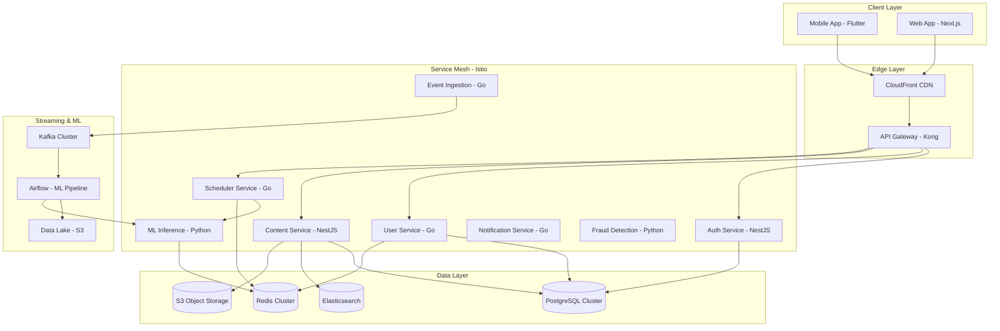
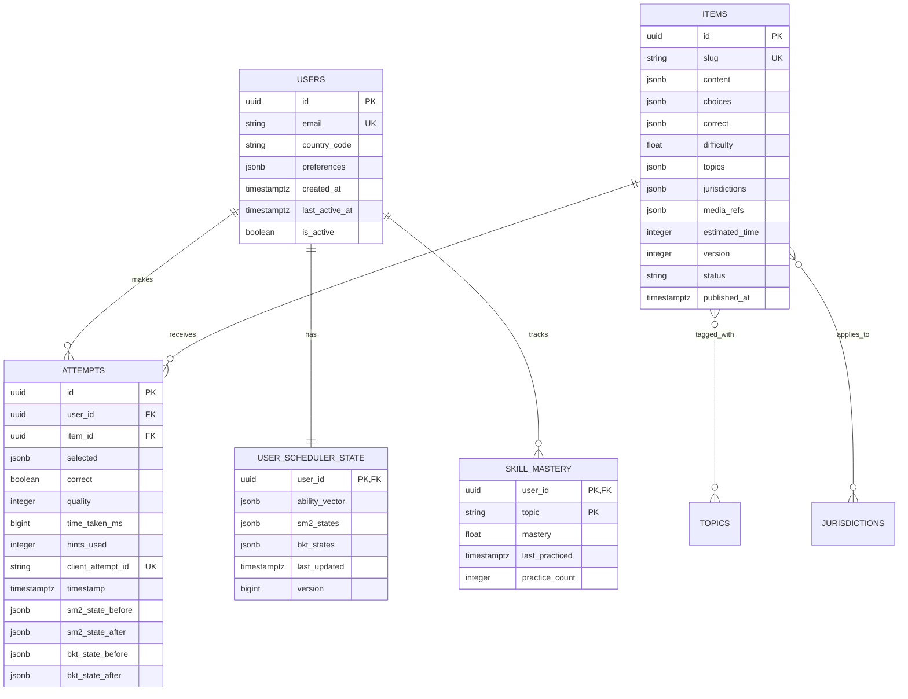

# Design Document

## Overview

The Adaptive Learning Platform is architected as a cloud-native, microservices-based system designed for global scale, supporting thousands of concurrent users with sub-300ms response times. The system employs a mobile-first approach with Flutter as the primary client, complemented by a Next.js web application, both consuming services through a unified API Gateway.

The core innovation lies in the hybrid adaptive learning engine that combines multiple machine learning algorithms (SM-2, IRT, BKT, contextual bandits, DKT) to create personalized learning paths. The architecture prioritizes offline-first mobile experience, real-time adaptability, and production-grade reliability.

## Architecture

### High-Level System Architecture



### Microservices Communication Patterns

**Internal Communication (gRPC)**

- Type-safe Protocol Buffer definitions
- Circuit breakers with exponential backoff
- Distributed tracing with OpenTelemetry
- Service mesh mutual TLS

**External Communication (REST)**

- OpenAPI 3.0 specifications
- JWT authentication at gateway
- Request/response validation
- Rate limiting and throttling

**Event-Driven Communication (Kafka)**

- Schema Registry with Avro/Protobuf
- Exactly-once semantics
- Dead letter queues
- Consumer group management

## Components and Interfaces

### 1. Authentication Service (NestJS + TypeScript)

**Responsibilities:**

- OAuth2/OIDC integration with multiple providers
- JWT token lifecycle management
- Multi-factor authentication
- Session management with Redis

**Key Interfaces:**

```typescript
interface AuthService {
  authenticate(credentials: AuthCredentials): Promise<AuthResult>;
  validateToken(token: string): Promise<UserClaims>;
  refreshToken(refreshToken: string): Promise<TokenPair>;
  enableMFA(userId: string, secret: string): Promise<MFAResult>;
  revokeSession(sessionId: string): Promise<void>;
}

interface AuthCredentials {
  provider: "oauth" | "credentials" | "social";
  token?: string;
  email?: string;
  password?: string;
  mfaCode?: string;
}
```

**Database Schema:**

```sql
CREATE TABLE users (
  id UUID PRIMARY KEY DEFAULT gen_random_uuid(),
  email VARCHAR(255) UNIQUE NOT NULL,
  hashed_password VARCHAR(255),
  country_code VARCHAR(2) NOT NULL,
  preferences JSONB DEFAULT '{}',
  mfa_secret VARCHAR(255),
  is_mfa_enabled BOOLEAN DEFAULT FALSE,
  failed_login_attempts INTEGER DEFAULT 0,
  locked_until TIMESTAMPTZ,
  created_at TIMESTAMPTZ DEFAULT NOW(),
  updated_at TIMESTAMPTZ DEFAULT NOW(),
  last_active_at TIMESTAMPTZ DEFAULT NOW(),
  is_active BOOLEAN DEFAULT TRUE
);

CREATE INDEX idx_users_email ON users(email);
CREATE INDEX idx_users_country_code ON users(country_code);
CREATE INDEX idx_users_last_active ON users(last_active_at);
```

### 2. User and Progress Service (Go)

**Responsibilities:**

- User profile management
- Learning progress tracking
- Scheduler state persistence
- High-concurrency user operations

**Key Interfaces:**

```go
type UserService interface {
    GetUser(ctx context.Context, userID string) (*User, error)
    UpdateUser(ctx context.Context, user *User) error
    GetSchedulerState(ctx context.Context, userID string) (*SchedulerState, error)
    UpdateSchedulerState(ctx context.Context, userID string, state *SchedulerState) error
    GetMastery(ctx context.Context, userID string, topics []string) (map[string]float64, error)
    UpdateMastery(ctx context.Context, userID string, mastery map[string]float64) error
}

type SchedulerState struct {
    UserID        string                 `json:"user_id"`
    AbilityVector map[string]float64     `json:"ability_vector"`
    SM2States     map[string]SM2State    `json:"sm2_states"`
    BKTStates     map[string]BKTState    `json:"bkt_states"`
    LastUpdated   time.Time              `json:"last_updated"`
    Version       int64                  `json:"version"`
}
```

**Database Schema:**

```sql
CREATE TABLE skill_mastery (
  user_id UUID REFERENCES users(id) ON DELETE CASCADE,
  topic VARCHAR(100) NOT NULL,
  mastery FLOAT NOT NULL CHECK (mastery >= 0 AND mastery <= 1),
  last_practiced TIMESTAMPTZ NOT NULL,
  practice_count INTEGER DEFAULT 0,
  PRIMARY KEY (user_id, topic)
);

CREATE TABLE user_scheduler_state (
  user_id UUID PRIMARY KEY REFERENCES users(id) ON DELETE CASCADE,
  ability_vector JSONB NOT NULL DEFAULT '{}',
  sm2_states JSONB NOT NULL DEFAULT '{}',
  bkt_states JSONB NOT NULL DEFAULT '{}',
  last_updated TIMESTAMPTZ DEFAULT NOW(),
  version BIGINT DEFAULT 1
);

CREATE INDEX idx_skill_mastery_user_id ON skill_mastery(user_id);
CREATE INDEX idx_skill_mastery_topic ON skill_mastery(topic);
```

### 3. Content Service and CMS (NestJS + TypeScript)

**Responsibilities:**

- Content creation and management
- Approval workflow orchestration
- Content delivery optimization
- Media asset management

**Key Interfaces:**

```typescript
interface ContentService {
  createItem(item: CreateItemDto): Promise<Item>;
  updateItem(id: string, updates: UpdateItemDto): Promise<Item>;
  getItem(id: string): Promise<Item>;
  queryItems(filters: ItemFilters): Promise<PaginatedItems>;
  publishItem(id: string): Promise<Item>;
  getItemsByJurisdiction(
    jurisdiction: string,
    topics?: string[]
  ): Promise<Item[]>;
}

interface Item {
  id: string;
  slug: string;
  content: ItemContent;
  choices: Choice[];
  correct: string | string[];
  difficulty: number;
  topics: string[];
  jurisdictions: string[];
  mediaRefs: MediaReference[];
  estimatedTime: number;
  version: number;
  status: "draft" | "review" | "approved" | "published";
  createdBy: string;
  publishedAt?: Date;
}

interface ItemContent {
  question: string;
  explanation?: string;
  hints?: string[];
  formatting?: ContentFormatting;
}
```

**Database Schema:**

```sql
CREATE TABLE items (
  id UUID PRIMARY KEY DEFAULT gen_random_uuid(),
  slug VARCHAR(255) UNIQUE NOT NULL,
  content JSONB NOT NULL,
  choices JSONB NOT NULL,
  correct JSONB NOT NULL,
  difficulty FLOAT NOT NULL DEFAULT 0.0,
  topics JSONB NOT NULL DEFAULT '[]',
  jurisdictions JSONB NOT NULL DEFAULT '[]',
  media_refs JSONB NOT NULL DEFAULT '[]',
  estimated_time INTEGER NOT NULL DEFAULT 60,
  version INTEGER NOT NULL DEFAULT 1,
  status VARCHAR(20) NOT NULL DEFAULT 'draft',
  created_by UUID REFERENCES users(id),
  published_at TIMESTAMPTZ,
  created_at TIMESTAMPTZ DEFAULT NOW(),
  updated_at TIMESTAMPTZ DEFAULT NOW(),
  is_active BOOLEAN DEFAULT TRUE
);

CREATE INDEX idx_items_slug ON items(slug);
CREATE INDEX idx_items_jurisdictions ON items USING GIN(jurisdictions);
CREATE INDEX idx_items_topics ON items USING GIN(topics);
CREATE INDEX idx_items_difficulty ON items(difficulty);
CREATE INDEX idx_items_status ON items(status);
CREATE INDEX idx_items_published_at ON items(published_at);
CREATE INDEX idx_items_content_fts ON items USING GIN(to_tsvector('english', content->>'question'));
```

### 4. Scheduler Service (Go) - Core Intelligence Engine

**Responsibilities:**

- Next-item selection using unified scoring
- SM-2 spaced repetition implementation
- Bayesian Knowledge Tracing
- IRT ability estimation
- Contextual bandit strategy selection

**Key Algorithms Implementation:**

**SM-2 Algorithm:**

```go
type SM2State struct {
    EasinessFactor float64   `json:"easiness_factor"`
    Interval       int       `json:"interval"`
    RepetitionCount int      `json:"repetition_count"`
    NextDue        time.Time `json:"next_due"`
}

func (s *SM2State) Update(quality int) {
    // Update easiness factor
    s.EasinessFactor = s.EasinessFactor + (0.1 - (5-quality)*(0.08+(5-quality)*0.02))
    if s.EasinessFactor < 1.3 {
        s.EasinessFactor = 1.3
    }

    // Update interval and repetition
    if quality < 3 {
        s.RepetitionCount = 0
        s.Interval = 1
    } else {
        s.RepetitionCount++
        if s.RepetitionCount == 1 {
            s.Interval = 1
        } else if s.RepetitionCount == 2 {
            s.Interval = 6
        } else {
            s.Interval = int(float64(s.Interval) * s.EasinessFactor)
        }
    }

    s.NextDue = time.Now().AddDate(0, 0, s.Interval)
}
```

**Bayesian Knowledge Tracing:**

```go
type BKTState struct {
    ProbKnowledge float64 `json:"prob_knowledge"`
    ProbGuess     float64 `json:"prob_guess"`
    ProbSlip      float64 `json:"prob_slip"`
    ProbLearn     float64 `json:"prob_learn"`
}

func (b *BKTState) UpdateAfterAttempt(correct bool) {
    var probCorrect float64
    if correct {
        probCorrect = b.ProbKnowledge*(1-b.ProbSlip) + (1-b.ProbKnowledge)*b.ProbGuess
        b.ProbKnowledge = (b.ProbKnowledge * (1 - b.ProbSlip)) / probCorrect
    } else {
        probIncorrect := b.ProbKnowledge*b.ProbSlip + (1-b.ProbKnowledge)*(1-b.ProbGuess)
        b.ProbKnowledge = (b.ProbKnowledge * b.ProbSlip) / probIncorrect
    }

    // Apply learning
    b.ProbKnowledge = b.ProbKnowledge + (1-b.ProbKnowledge)*b.ProbLearn
}
```

**Unified Scoring Function:**

```go
type ScoringWeights struct {
    DueUrgency    float64 `json:"due_urgency"`
    MasteryGap    float64 `json:"mastery_gap"`
    DifficultyGap float64 `json:"difficulty_gap"`
    SM2Priority   float64 `json:"sm2_priority"`
    BanditBonus   float64 `json:"bandit_bonus"`
}

func (s *SchedulerService) ComputeUnifiedScore(
    item *Item,
    userState *SchedulerState,
    weights *ScoringWeights,
) float64 {
    // Due urgency from SM-2
    sm2State := userState.SM2States[item.ID]
    daysUntilDue := time.Until(sm2State.NextDue).Hours() / 24
    dueUrgency := sigmoid(-daysUntilDue) // Past due = high urgency

    // Mastery gap from BKT
    avgMastery := s.getAverageMastery(userState, item.Topics)
    masteryGap := 1.0 - avgMastery

    // Difficulty gap from IRT
    userAbility := s.getAverageAbility(userState, item.Topics)
    difficultyGap := gaussian(userAbility - item.Difficulty) // Peak at optimal challenge

    // SM-2 priority
    sm2Priority := (3.0 - sm2State.EasinessFactor) / 2.0 // Lower EF = higher priority

    // Bandit exploration bonus
    banditBonus := s.getBanditBonus(item, userState)

    return weights.DueUrgency*dueUrgency +
           weights.MasteryGap*masteryGap +
           weights.DifficultyGap*difficultyGap +
           weights.SM2Priority*sm2Priority +
           weights.BanditBonus*banditBonus
}
```

### 5. ML Inference Service (Python + FastAPI)

**Responsibilities:**

- Deep Knowledge Tracing model serving
- Real-time prediction generation
- Model versioning and A/B testing
- Explainability and feature importance

**DKT Model Architecture:**

```python
import torch
import torch.nn as nn
from typing import List, Dict, Tuple

class DKTModel(nn.Module):
    def __init__(self,
                 num_items: int,
                 num_topics: int,
                 embedding_dim: int = 128,
                 hidden_dim: int = 256,
                 num_layers: int = 2):
        super().__init__()

        # Embeddings for items and topics
        self.item_embedding = nn.Embedding(num_items, embedding_dim)
        self.topic_embedding = nn.Embedding(num_topics, embedding_dim)

        # Input projection
        self.input_projection = nn.Linear(
            embedding_dim * 2 + 4,  # item + topic + [correct, time, hints, difficulty]
            hidden_dim
        )

        # LSTM layers
        self.lstm = nn.LSTM(
            hidden_dim,
            hidden_dim,
            num_layers,
            batch_first=True,
            dropout=0.2
        )

        # Output heads
        self.correctness_head = nn.Linear(hidden_dim, 1)
        self.mastery_head = nn.Linear(hidden_dim, num_topics)

    def forward(self, sequences: torch.Tensor) -> Dict[str, torch.Tensor]:
        batch_size, seq_len = sequences.shape[:2]

        # Extract features
        item_ids = sequences[:, :, 0].long()
        topic_ids = sequences[:, :, 1].long()
        features = sequences[:, :, 2:6]  # correct, time, hints, difficulty

        # Embeddings
        item_emb = self.item_embedding(item_ids)
        topic_emb = self.topic_embedding(topic_ids)

        # Combine features
        combined = torch.cat([item_emb, topic_emb, features], dim=-1)
        projected = self.input_projection(combined)

        # LSTM forward pass
        lstm_out, _ = self.lstm(projected)

        # Predictions
        correctness_pred = torch.sigmoid(self.correctness_head(lstm_out))
        mastery_pred = torch.sigmoid(self.mastery_head(lstm_out))

        return {
            'correctness': correctness_pred,
            'mastery': mastery_pred
        }

class MLInferenceService:
    def __init__(self):
        self.models = {}  # Model registry
        self.redis_client = redis.Redis()

    async def predict_batch(self,
                          user_sequences: List[Dict],
                          model_version: str = "latest") -> List[Dict]:
        """Batch prediction for multiple users"""
        model = self.models[model_version]

        # Prepare batch tensor
        batch_tensor = self.prepare_batch(user_sequences)

        with torch.no_grad():
            predictions = model(batch_tensor)

        # Cache predictions
        for i, user_seq in enumerate(user_sequences):
            cache_key = f"prediction:{user_seq['user_id']}:{model_version}"
            pred_data = {
                'correctness': predictions['correctness'][i].tolist(),
                'mastery': predictions['mastery'][i].tolist(),
                'timestamp': time.time()
            }
            await self.redis_client.setex(
                cache_key,
                300,  # 5 minute TTL
                json.dumps(pred_data)
            )

        return self.format_predictions(predictions, user_sequences)
```

### 6. Event Ingestion Service (Go)

**Responsibilities:**

- High-throughput event collection
- Schema validation and transformation
- Kafka publishing with exactly-once semantics
- Backpressure handling

**Event Schema Definitions:**

```protobuf
syntax = "proto3";

message AttemptEvent {
  string user_id = 1;
  string item_id = 2;
  string session_id = 3;
  google.protobuf.Any selected = 4;
  bool correct = 5;
  int32 quality = 6;
  int64 time_taken_ms = 7;
  int32 hints_used = 8;
  string client_attempt_id = 9;
  int64 timestamp = 10;

  // State snapshots for ML training
  SM2StateSnapshot sm2_before = 11;
  SM2StateSnapshot sm2_after = 12;
  BKTStateSnapshot bkt_before = 13;
  BKTStateSnapshot bkt_after = 14;
  IRTStateSnapshot irt_before = 15;
  IRTStateSnapshot irt_after = 16;
}

message SessionEvent {
  string session_id = 1;
  string user_id = 2;
  int64 start_time = 3;
  int64 end_time = 4;
  int32 items_attempted = 5;
  int32 correct_count = 6;
  int64 total_time_ms = 7;
  SessionType session_type = 8;
  string device_type = 9;
  string app_version = 10;
}

enum SessionType {
  PRACTICE = 0;
  REVIEW = 1;
  MOCK_TEST = 2;
  PLACEMENT = 3;
}
```

## Data Models

### Core Entity Relationships



### Redis Data Structures

**Hot User State Cache:**

```
user:state:{user_id} -> {
  "ability_vector": {"traffic_signs": 0.75, "right_of_way": 0.45},
  "sm2_states": {
    "item_123": {"easiness_factor": 2.5, "interval": 3, "next_due": "2024-01-15T10:00:00Z"},
    "item_456": {"easiness_factor": 1.8, "interval": 1, "next_due": "2024-01-12T10:00:00Z"}
  },
  "bkt_states": {
    "traffic_signs": {"prob_knowledge": 0.85, "prob_guess": 0.25, "prob_slip": 0.1},
    "right_of_way": {"prob_knowledge": 0.45, "prob_guess": 0.25, "prob_slip": 0.15}
  },
  "last_updated": "2024-01-11T15:30:00Z",
  "version": 42
}
TTL: 3600 seconds
```

**Content Cache:**

```
content:item:{item_id} -> {
  "id": "uuid",
  "content": {...},
  "difficulty": 0.75,
  "topics": ["traffic_signs"],
  "jurisdictions": ["CA", "US-CA"]
}
TTL: 1800 seconds
```

**Prediction Cache:**

```
prediction:{user_id}:{model_version} -> {
  "correctness": [0.85, 0.72, 0.91],
  "mastery": {"traffic_signs": 0.88, "right_of_way": 0.52},
  "timestamp": 1704985800
}
TTL: 300 seconds
```

## Error Handling

### Error Classification and Response Strategies

**1. Client Errors (4xx)**

```typescript
enum ClientErrorType {
  VALIDATION_ERROR = "VALIDATION_ERROR",
  AUTHENTICATION_ERROR = "AUTHENTICATION_ERROR",
  AUTHORIZATION_ERROR = "AUTHORIZATION_ERROR",
  RESOURCE_NOT_FOUND = "RESOURCE_NOT_FOUND",
  RATE_LIMIT_EXCEEDED = "RATE_LIMIT_EXCEEDED",
}

interface ErrorResponse {
  error: {
    type: ClientErrorType;
    message: string;
    details?: Record<string, any>;
    requestId: string;
    timestamp: string;
  };
}
```

**2. Server Errors (5xx)**

```go
type ServerError struct {
    Type      string                 `json:"type"`
    Message   string                 `json:"message"`
    RequestID string                 `json:"request_id"`
    Timestamp time.Time              `json:"timestamp"`
    Context   map[string]interface{} `json:"context,omitempty"`
}

const (
    DatabaseError     = "DATABASE_ERROR"
    ServiceUnavailable = "SERVICE_UNAVAILABLE"
    InternalError     = "INTERNAL_ERROR"
    TimeoutError      = "TIMEOUT_ERROR"
)
```

**3. Circuit Breaker Implementation**

```go
type CircuitBreaker struct {
    maxFailures   int
    resetTimeout  time.Duration
    state         CircuitState
    failures      int
    lastFailTime  time.Time
    mutex         sync.RWMutex
}

func (cb *CircuitBreaker) Call(fn func() error) error {
    cb.mutex.RLock()
    state := cb.state
    cb.mutex.RUnlock()

    if state == CircuitOpen {
        if time.Since(cb.lastFailTime) > cb.resetTimeout {
            cb.setState(CircuitHalfOpen)
        } else {
            return ErrCircuitOpen
        }
    }

    err := fn()
    if err != nil {
        cb.recordFailure()
        return err
    }

    cb.recordSuccess()
    return nil
}
```

**4. Graceful Degradation Strategies**

- **Scheduler Service**: Fall back to simple due-date sorting if ML inference fails
- **Content Service**: Serve cached content if database is unavailable
- **Authentication**: Allow cached token validation during identity provider outages
- **Mobile App**: Switch to offline mode seamlessly when network fails

## Testing Strategy

### 1. Unit Testing

**Go Services Testing:**

```go
func TestSchedulerUnifiedScoring(t *testing.T) {
    tests := []struct {
        name           string
        item           *Item
        userState      *SchedulerState
        weights        *ScoringWeights
        expectedScore  float64
        tolerance      float64
    }{
        {
            name: "overdue_item_high_score",
            item: &Item{
                ID: "item1",
                Difficulty: 0.5,
                Topics: []string{"traffic_signs"},
            },
            userState: &SchedulerState{
                SM2States: map[string]SM2State{
                    "item1": {NextDue: time.Now().Add(-24 * time.Hour)},
                },
                AbilityVector: map[string]float64{"traffic_signs": 0.5},
            },
            weights: &ScoringWeights{
                DueUrgency: 1.0,
                MasteryGap: 0.5,
                DifficultyGap: 0.3,
            },
            expectedScore: 0.85,
            tolerance: 0.1,
        },
    }

    scheduler := NewSchedulerService()
    for _, tt := range tests {
        t.Run(tt.name, func(t *testing.T) {
            score := scheduler.ComputeUnifiedScore(tt.item, tt.userState, tt.weights)
            assert.InDelta(t, tt.expectedScore, score, tt.tolerance)
        })
    }
}
```

**TypeScript Services Testing:**

```typescript
describe("ContentService", () => {
  let service: ContentService;
  let mockRepository: jest.Mocked<ItemRepository>;

  beforeEach(() => {
    mockRepository = createMockRepository();
    service = new ContentService(mockRepository);
  });

  describe("createItem", () => {
    it("should validate item content and create with proper defaults", async () => {
      const createDto: CreateItemDto = {
        slug: "test-item",
        content: { question: "What is the speed limit?" },
        choices: [
          { id: "a", text: "25 mph" },
          { id: "b", text: "35 mph" },
        ],
        correct: "b",
        topics: ["speed_limits"],
        jurisdictions: ["US-CA"],
      };

      mockRepository.create.mockResolvedValue(mockItem);

      const result = await service.createItem(createDto);

      expect(result.status).toBe("draft");
      expect(result.version).toBe(1);
      expect(mockRepository.create).toHaveBeenCalledWith(
        expect.objectContaining({
          difficulty: 0.0, // Default difficulty
          estimatedTime: 60, // Default time
        })
      );
    });
  });
});
```

### 2. Integration Testing

**API Integration Tests:**

```typescript
describe("Learning Flow Integration", () => {
  let app: INestApplication;
  let userToken: string;

  beforeAll(async () => {
    app = await createTestApp();
    userToken = await authenticateTestUser();
  });

  it("should complete full learning session flow", async () => {
    // 1. Get placement test
    const placementResponse = await request(app.getHttpServer())
      .get("/v1/placement/items")
      .set("Authorization", `Bearer ${userToken}`)
      .expect(200);

    expect(placementResponse.body.items).toHaveLength(15);

    // 2. Submit placement responses
    const placementAttempts = placementResponse.body.items.map((item) => ({
      itemId: item.id,
      selected: item.choices[0].id,
      timeTaken: 30000,
    }));

    await request(app.getHttpServer())
      .post("/v1/placement/submit")
      .set("Authorization", `Bearer ${userToken}`)
      .send({ attempts: placementAttempts })
      .expect(201);

    // 3. Get personalized next items
    const nextItemsResponse = await request(app.getHttpServer())
      .get("/v1/scheduler/next-items")
      .set("Authorization", `Bearer ${userToken}`)
      .expect(200);

    expect(nextItemsResponse.body.items).toHaveLength(5);
    expect(nextItemsResponse.body.sessionType).toBeDefined();

    // 4. Submit practice attempts
    const practiceAttempt = {
      itemId: nextItemsResponse.body.items[0].id,
      selected: "correct_answer",
      timeTaken: 45000,
      hintsUsed: 0,
    };

    const attemptResponse = await request(app.getHttpServer())
      .post("/v1/attempts")
      .set("Authorization", `Bearer ${userToken}`)
      .send(practiceAttempt)
      .expect(201);

    expect(attemptResponse.body.correct).toBe(true);
    expect(attemptResponse.body.nextItems).toBeDefined();
  });
});
```

### 3. Load Testing

**K6 Load Test Script:**

```javascript
import http from "k6/http";
import { check, sleep } from "k6";
import { Rate } from "k6/metrics";

const errorRate = new Rate("errors");

export let options = {
  stages: [
    { duration: "2m", target: 100 }, // Ramp up
    { duration: "5m", target: 1000 }, // Stay at 1000 users
    { duration: "2m", target: 0 }, // Ramp down
  ],
  thresholds: {
    http_req_duration: ["p(95)<300"], // 95% under 300ms
    errors: ["rate<0.01"], // Error rate under 1%
  },
};

export default function () {
  // Authenticate
  const authResponse = http.post("https://api.example.com/v1/auth/login", {
    email: `user${__VU}@test.com`,
    password: "testpass123",
  });

  check(authResponse, {
    "auth successful": (r) => r.status === 200,
  }) || errorRate.add(1);

  const token = authResponse.json("access_token");
  const headers = { Authorization: `Bearer ${token}` };

  // Get next items (critical path)
  const nextItemsResponse = http.get(
    "https://api.example.com/v1/scheduler/next-items",
    { headers }
  );

  check(nextItemsResponse, {
    "next items retrieved": (r) => r.status === 200,
    "response time < 300ms": (r) => r.timings.duration < 300,
    "has items": (r) => r.json("items").length > 0,
  }) || errorRate.add(1);

  // Submit attempt
  const items = nextItemsResponse.json("items");
  if (items.length > 0) {
    const attemptResponse = http.post(
      "https://api.example.com/v1/attempts",
      JSON.stringify({
        itemId: items[0].id,
        selected: items[0].choices[0].id,
        timeTaken: Math.random() * 60000 + 10000,
      }),
      { headers: { ...headers, "Content-Type": "application/json" } }
    );

    check(attemptResponse, {
      "attempt submitted": (r) => r.status === 201,
    }) || errorRate.add(1);
  }

  sleep(Math.random() * 3 + 1); // 1-4 second think time
}
```

### 4. End-to-End Testing

**Flutter Integration Tests:**

```dart
import 'package:flutter_test/flutter_test.dart';
import 'package:integration_test/integration_test.dart';
import 'package:adaptive_learning_app/main.dart' as app;

void main() {
  IntegrationTestWidgetsFlutterBinding.ensureInitialized();

  group('Learning Session E2E', () {
    testWidgets('complete offline learning session', (tester) async {
      app.main();
      await tester.pumpAndSettle();

      // Login
      await tester.enterText(find.byKey(Key('email_field')), 'test@example.com');
      await tester.enterText(find.byKey(Key('password_field')), 'password123');
      await tester.tap(find.byKey(Key('login_button')));
      await tester.pumpAndSettle();

      // Verify home screen
      expect(find.text('Welcome back!'), findsOneWidget);

      // Start practice session
      await tester.tap(find.byKey(Key('start_practice_button')));
      await tester.pumpAndSettle();

      // Answer questions
      for (int i = 0; i < 5; i++) {
        // Wait for question to load
        await tester.pumpAndSettle(Duration(seconds: 2));

        // Select first choice
        await tester.tap(find.byKey(Key('choice_0')));
        await tester.tap(find.byKey(Key('submit_answer')));
        await tester.pumpAndSettle();

        // Verify feedback
        expect(find.byKey(Key('answer_feedback')), findsOneWidget);

        // Continue to next question
        await tester.tap(find.byKey(Key('next_question')));
        await tester.pumpAndSettle();
      }

      // Verify session completion
      expect(find.text('Session Complete!'), findsOneWidget);
      expect(find.byKey(Key('session_stats')), findsOneWidget);
    });

    testWidgets('offline mode functionality', (tester) async {
      app.main();
      await tester.pumpAndSettle();

      // Simulate offline mode
      await tester.binding.defaultBinaryMessenger.setMockMethodCallHandler(
        MethodChannel('connectivity_plus'),
        (call) async {
          if (call.method == 'check') {
            return 'none';
          }
          return null;
        },
      );

      // Verify offline indicator
      expect(find.byKey(Key('offline_indicator')), findsOneWidget);

      // Start practice session offline
      await tester.tap(find.byKey(Key('start_practice_button')));
      await tester.pumpAndSettle();

      // Verify questions load from cache
      expect(find.byKey(Key('question_content')), findsOneWidget);

      // Complete session offline
      for (int i = 0; i < 3; i++) {
        await tester.tap(find.byKey(Key('choice_0')));
        await tester.tap(find.byKey(Key('submit_answer')));
        await tester.pumpAndSettle();
        await tester.tap(find.byKey(Key('next_question')));
        await tester.pumpAndSettle();
      }

      // Verify pending sync indicator
      expect(find.byKey(Key('pending_sync_indicator')), findsOneWidget);
    });
  });
}
```

This comprehensive design document provides the foundation for building a production-ready adaptive learning platform. The architecture emphasizes scalability, reliability, and performance while maintaining the flexibility needed for continuous improvement of the learning algorithms.
