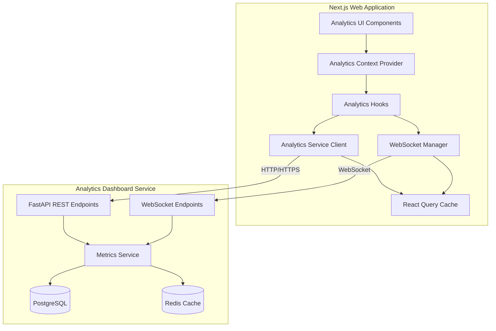
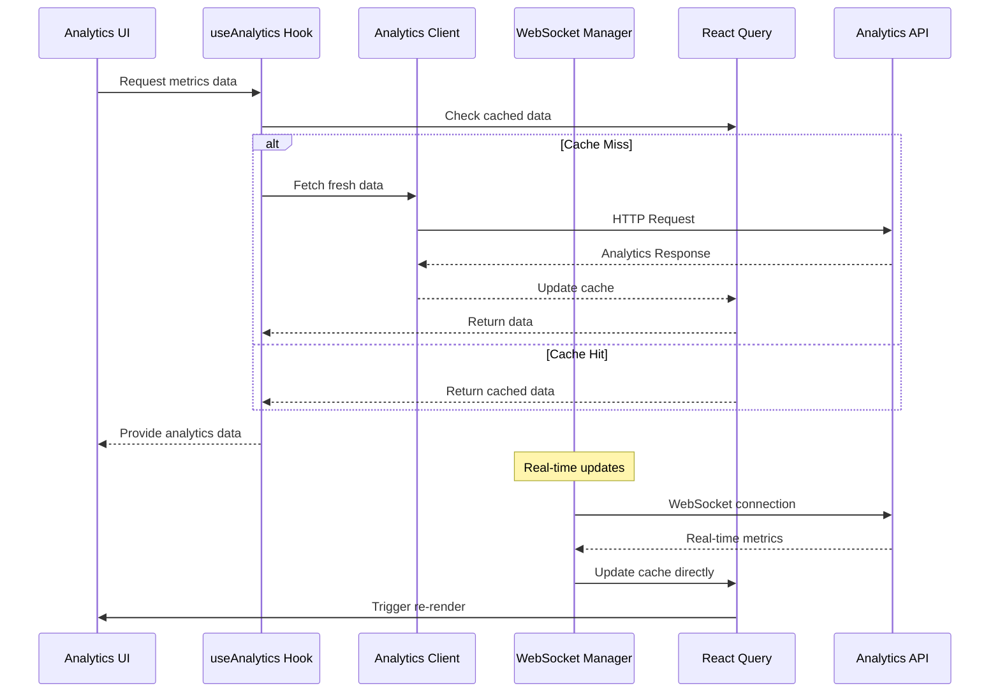

# Analytics Dashboard Integration Design

## Overview

This design document outlines the comprehensive integration architecture between the Next.js web application and the analytics-dashboard microservice. The solution provides real-time analytics capabilities while maintaining consistency with existing service integration patterns, ensuring optimal performance, and implementing robust error handling and resilience mechanisms.

The integration follows a layered architecture approach with clear separation of concerns: a transport layer for network communication, a protocol layer for data transformation, a domain layer for business logic, and a presentation layer for UI components. This design ensures maintainability, testability, and scalability while providing a seamless developer experience.

## Architecture

### High-Level Architecture Diagram



### Component Interaction Flow



## Components and Interfaces

### 1. Analytics Service Client

The core client responsible for all communication with the analytics-dashboard service.

#### Interface Definition

```typescript
interface AnalyticsServiceClient {
  // Core Analytics Methods
  getEngagementMetrics(params?: EngagementMetricsParams): Promise<UserEngagementMetrics>
  getProgressMetrics(params?: ProgressMetricsParams): Promise<LearningProgressMetrics>
  getContentMetrics(params?: ContentMetricsParams): Promise<ContentPerformanceMetrics>
  getSystemMetrics(params?: SystemMetricsParams): Promise<SystemPerformanceMetrics>
  getRealtimeSnapshot(): Promise<RealtimeMetricsSnapshot>
  
  // Query Methods
  queryHistoricalMetrics(query: HistoricalQuery): Promise<TimeSeriesData>
  
  // Insights Methods
  getBehaviorInsights(userId?: string): Promise<BehaviorInsights>
  getContentGaps(): Promise<ContentGapAnalysis>
  
  // Reports Methods
  getEffectivenessReport(filters?: ReportFilters): Promise<EffectivenessReport>
  
  // System Methods
  getAlerts(severity?: AlertSeverity): Promise<Alert[]>
  getSystemPerformance(): Promise<SystemPerformanceDetails>
  getSystemStatus(): Promise<SystemStatus>
  
  // User Analytics Methods
  getHourlyEngagement(userId: string, date?: Date): Promise<HourlyEngagement>
  getCohortRetention(cohortId: string): Promise<CohortRetention>
  getUserSegments(): Promise<UserSegment[]>
  getUserJourney(userId: string): Promise<UserJourney>
  getBehaviorPatterns(userId?: string): Promise<BehaviorPattern[]>
  
  // Configuration and Health
  getConfig(): AnalyticsClientConfig
  getHealthStatus(): Promise<ServiceHealthStatus>
}
```

#### Client Architecture

```typescript
class AnalyticsServiceClient {
  private httpClient: AxiosInstance
  private config: AnalyticsClientConfig
  private circuitBreaker: CircuitBreaker
  private requestQueue: RequestQueue
  private metrics: ClientMetrics
  
  constructor(config?: Partial<AnalyticsClientConfig>) {
    this.config = this.mergeWithDefaults(config)
    this.httpClient = this.createHttpClient()
    this.circuitBreaker = new CircuitBreaker(this.config.circuitBreaker)
    this.requestQueue = new RequestQueue(this.config.requestQueue)
    this.metrics = new ClientMetrics()
  }
  
  private createHttpClient(): AxiosInstance {
    const client = axios.create({
      baseURL: this.config.baseUrl,
      timeout: this.config.timeout,
      headers: {
        'Content-Type': 'application/json',
        'Accept': 'application/json'
      }
    })
    
    // Request interceptor for authentication
    client.interceptors.request.use(this.attachAuthToken.bind(this))
    
    // Response interceptor for error handling and data transformation
    client.interceptors.response.use(
      this.transformResponse.bind(this),
      this.handleError.bind(this)
    )
    
    return client
  }
}
```

### 2. WebSocket Manager

Handles real-time communication with the analytics-dashboard service.

#### WebSocket Manager Architecture

```typescript
class AnalyticsWebSocketManager {
  private connection: WebSocket | null = null
  private connectionState: ConnectionState = 'disconnected'
  private subscriptions: Map<string, Set<SubscriptionHandler>> = new Map()
  private reconnectAttempts: number = 0
  private heartbeatInterval: NodeJS.Timeout | null = null
  private messageQueue: QueuedMessage[] = []
  
  constructor(private config: WebSocketConfig) {}
  
  async connect(): Promise<void> {
    if (this.connectionState === 'connected') return
    
    this.connectionState = 'connecting'
    
    try {
      this.connection = new WebSocket(this.config.url)
      this.setupEventHandlers()
      await this.waitForConnection()
      this.connectionState = 'connected'
      this.startHeartbeat()
      this.processQueuedMessages()
      this.reconnectAttempts = 0
    } catch (error) {
      this.connectionState = 'disconnected'
      this.scheduleReconnect()
      throw error
    }
  }
  
  subscribe(messageType: string, handler: SubscriptionHandler): () => void {
    if (!this.subscriptions.has(messageType)) {
      this.subscriptions.set(messageType, new Set())
    }
    
    this.subscriptions.get(messageType)!.add(handler)
    
    // Send subscription message to server
    this.send({
      type: 'subscribe',
      metrics_type: messageType
    })
    
    // Return unsubscribe function
    return () => {
      this.subscriptions.get(messageType)?.delete(handler)
      if (this.subscriptions.get(messageType)?.size === 0) {
        this.send({
          type: 'unsubscribe',
          metrics_type: messageType
        })
      }
    }
  }
  
  private handleMessage(event: MessageEvent): void {
    try {
      const message = JSON.parse(event.data)
      const messageType = this.determineMessageType(message)
      
      const handlers = this.subscriptions.get(messageType) || new Set()
      handlers.forEach(handler => {
        try {
          handler(message)
        } catch (error) {
          console.error('Error in subscription handler:', error)
        }
      })
    } catch (error) {
      console.error('Error parsing WebSocket message:', error)
    }
  }
}
```

### 3. React Query Integration

Seamless integration with the existing React Query setup for optimal caching and state management.

#### Query Configuration

```typescript
// Query key factory for hierarchical organization
export const analyticsQueryKeys = {
  all: ['analytics'] as const,
  engagement: (params?: EngagementMetricsParams) => 
    [...analyticsQueryKeys.all, 'engagement', params] as const,
  progress: (userId?: string, timeRange?: TimeRange) => 
    [...analyticsQueryKeys.all, 'progress', userId, timeRange] as const,
  content: (contentId?: string, filters?: ContentFilters) => 
    [...analyticsQueryKeys.all, 'content', contentId, filters] as const,
  system: (timeRange?: TimeRange) => 
    [...analyticsQueryKeys.all, 'system', timeRange] as const,
  insights: (type: string, params?: any) => 
    [...analyticsQueryKeys.all, 'insights', type, params] as const,
  reports: (type: string, filters?: any) => 
    [...analyticsQueryKeys.all, 'reports', type, filters] as const
}

// Query configuration with appropriate cache times
export const analyticsQueryConfig = {
  engagement: {
    staleTime: 30000, // 30 seconds
    cacheTime: 300000, // 5 minutes
    refetchInterval: 60000, // 1 minute
    retry: 3
  },
  progress: {
    staleTime: 60000, // 1 minute
    cacheTime: 600000, // 10 minutes
    refetchInterval: 300000, // 5 minutes
    retry: 3
  },
  historical: {
    staleTime: 3600000, // 1 hour
    cacheTime: 7200000, // 2 hours
    refetchInterval: false,
    retry: 2
  },
  realtime: {
    staleTime: 0, // Always stale
    cacheTime: 60000, // 1 minute
    refetchInterval: 30000, // 30 seconds
    retry: 5
  }
}
```

#### Custom Hooks

```typescript
// Core analytics hook
export function useAnalytics() {
  const queryClient = useQueryClient()
  const webSocketManager = useWebSocketManager()
  
  const invalidateAnalytics = useCallback((queryKey?: QueryKey) => {
    if (queryKey) {
      queryClient.invalidateQueries({ queryKey })
    } else {
      queryClient.invalidateQueries({ queryKey: analyticsQueryKeys.all })
    }
  }, [queryClient])
  
  const updateAnalyticsCache = useCallback((data: any, queryKey: QueryKey) => {
    queryClient.setQueryData(queryKey, data)
  }, [queryClient])
  
  return {
    invalidateAnalytics,
    updateAnalyticsCache,
    webSocketManager
  }
}

// Engagement metrics hook
export function useEngagementMetrics(params?: EngagementMetricsParams) {
  const { data, isLoading, error, refetch } = useQuery({
    queryKey: analyticsQueryKeys.engagement(params),
    queryFn: () => analyticsServiceClient.getEngagementMetrics(params),
    ...analyticsQueryConfig.engagement
  })
  
  return {
    engagementMetrics: data,
    isLoading,
    error,
    refetch
  }
}

// Real-time metrics hook with WebSocket integration
export function useRealtimeMetrics() {
  const queryClient = useQueryClient()
  const [isConnected, setIsConnected] = useState(false)
  
  useEffect(() => {
    const webSocketManager = getAnalyticsWebSocketManager()
    
    const unsubscribe = webSocketManager.subscribe('metrics', (message) => {
      // Update React Query cache with real-time data
      if (message.engagement) {
        queryClient.setQueryData(
          analyticsQueryKeys.engagement(),
          message.engagement
        )
      }
      
      if (message.progress) {
        queryClient.setQueryData(
          analyticsQueryKeys.progress(),
          message.progress
        )
      }
      
      if (message.content) {
        queryClient.setQueryData(
          analyticsQueryKeys.content(),
          message.content
        )
      }
      
      if (message.system) {
        queryClient.setQueryData(
          analyticsQueryKeys.system(),
          message.system
        )
      }
    })
    
    webSocketManager.connect().then(() => {
      setIsConnected(true)
    }).catch(() => {
      setIsConnected(false)
    })
    
    return unsubscribe
  }, [queryClient])
  
  return { isConnected }
}
```

### 4. Analytics Context Provider

Centralized state management and configuration for analytics features.

```typescript
interface AnalyticsContextValue {
  client: AnalyticsServiceClient
  webSocketManager: AnalyticsWebSocketManager
  isConnected: boolean
  connectionStatus: ConnectionStatus
  config: AnalyticsConfig
  permissions: AnalyticsPermissions
}

export const AnalyticsContext = createContext<AnalyticsContextValue | null>(null)

export function AnalyticsProvider({ children }: { children: React.ReactNode }) {
  const { user } = useAuth()
  const [client] = useState(() => new AnalyticsServiceClient())
  const [webSocketManager] = useState(() => new AnalyticsWebSocketManager())
  const [isConnected, setIsConnected] = useState(false)
  const [connectionStatus, setConnectionStatus] = useState<ConnectionStatus>('disconnected')
  
  const config = useMemo(() => ({
    baseUrl: process.env.NEXT_PUBLIC_ANALYTICS_SERVICE_URL!,
    wsUrl: process.env.NEXT_PUBLIC_ANALYTICS_SERVICE_WS_URL!,
    enableRealtime: true,
    enableCaching: true,
    permissions: getUserAnalyticsPermissions(user)
  }), [user])
  
  useEffect(() => {
    // Initialize WebSocket connection when analytics features are accessed
    if (config.enableRealtime) {
      webSocketManager.connect()
        .then(() => {
          setIsConnected(true)
          setConnectionStatus('connected')
        })
        .catch(() => {
          setIsConnected(false)
          setConnectionStatus('error')
        })
    }
    
    return () => {
      webSocketManager.disconnect()
    }
  }, [webSocketManager, config.enableRealtime])
  
  const value = useMemo(() => ({
    client,
    webSocketManager,
    isConnected,
    connectionStatus,
    config,
    permissions: config.permissions
  }), [client, webSocketManager, isConnected, connectionStatus, config])
  
  return (
    <AnalyticsContext.Provider value={value}>
      {children}
    </AnalyticsContext.Provider>
  )
}
```

## Data Models

### Core Analytics Types

```typescript
// Base interfaces matching Python Pydantic models
export interface UserEngagementMetrics {
  timestamp: string
  activeUsers1h: number
  activeUsers24h: number
  newUsers24h: number
  sessionsStarted1h: number
  avgSessionDurationMinutes: number
  bounceRate: number
  retentionRateD1: number
  retentionRateD7: number
  retentionRateD30: number
}

export interface LearningProgressMetrics {
  timestamp: string
  totalCompletions24h: number
  avgAccuracy: number
  avgResponseTimeMs: number
  masteryAchievements24h: number
  strugglingUsers: number
  topPerformers: number
  contentCompletionRate: number
  skillProgressRate: number
}

export interface ContentPerformanceMetrics {
  timestamp: string
  totalItems: number
  avgDifficulty: number
  avgAccuracy: number
  avgResponseTimeMs: number
  itemsNeedingReview: number
  topPerformingItems: ContentItem[]
  strugglingItems: ContentItem[]
  contentGaps: ContentGap[]
}

export interface SystemPerformanceMetrics {
  timestamp: string
  apiResponseTimeMs: number
  errorRate: number
  activeConnections: number
  memoryUsagePercent: number
  cpuUsagePercent: number
  diskUsagePercent: number
  cacheHitRate: number
  queueDepth: number
}

export interface Alert {
  id: string
  type: 'system_performance' | 'data_quality' | 'user_behavior' | 'content_performance'
  severity: 'info' | 'warning' | 'error' | 'critical'
  title: string
  message: string
  details: Record<string, any>
  timestamp: string
  resolved: boolean
  resolvedBy?: string
  resolvedAt?: string
}

// WebSocket message types
export interface MetricsUpdate {
  timestamp: string
  engagement?: UserEngagementMetrics
  progress?: LearningProgressMetrics
  content?: ContentPerformanceMetrics
  system?: SystemPerformanceMetrics
}

export interface AlertMessage {
  timestamp: string
  alerts: Alert[]
}
```

### Request/Response Types

```typescript
// Query parameter types
export interface EngagementMetricsParams {
  timeRange?: TimeRange
  userId?: string
  filters?: EngagementFilters
}

export interface ProgressMetricsParams {
  userId?: string
  timeRange?: TimeRange
  skillId?: string
  contentId?: string
}

export interface ContentMetricsParams {
  contentId?: string
  filters?: ContentFilters
  timeRange?: TimeRange
}

export interface SystemMetricsParams {
  timeRange?: TimeRange
  includeDetails?: boolean
}

// Common types
export interface TimeRange {
  start: Date
  end: Date
  granularity?: 'hour' | 'day' | 'week' | 'month'
}

export interface EngagementFilters {
  userSegment?: string
  platform?: 'web' | 'mobile'
  region?: string
}

export interface ContentFilters {
  difficulty?: 'easy' | 'medium' | 'hard'
  topic?: string
  contentType?: string
}
```

## Error Handling

### Error Classification and Response Strategy

```typescript
// Error type hierarchy
export abstract class AnalyticsError extends Error {
  abstract readonly code: string
  abstract readonly retryable: boolean
  abstract readonly severity: 'low' | 'medium' | 'high' | 'critical'
}

export class NetworkError extends AnalyticsError {
  readonly code = 'NETWORK_ERROR'
  readonly retryable = true
  readonly severity = 'medium'
}

export class AuthenticationError extends AnalyticsError {
  readonly code = 'AUTH_ERROR'
  readonly retryable = true
  readonly severity = 'high'
}

export class ValidationError extends AnalyticsError {
  readonly code = 'VALIDATION_ERROR'
  readonly retryable = false
  readonly severity = 'low'
}

export class ServiceUnavailableError extends AnalyticsError {
  readonly code = 'SERVICE_UNAVAILABLE'
  readonly retryable = true
  readonly severity = 'high'
}

export class RateLimitError extends AnalyticsError {
  readonly code = 'RATE_LIMIT'
  readonly retryable = true
  readonly severity = 'medium'
}

// Circuit breaker implementation
export class CircuitBreaker {
  private state: 'closed' | 'open' | 'half-open' = 'closed'
  private failureCount = 0
  private lastFailureTime = 0
  private successCount = 0
  
  constructor(private config: CircuitBreakerConfig) {}
  
  async execute<T>(operation: () => Promise<T>): Promise<T> {
    if (this.state === 'open') {
      if (Date.now() - this.lastFailureTime > this.config.timeout) {
        this.state = 'half-open'
        this.successCount = 0
      } else {
        throw new ServiceUnavailableError('Circuit breaker is open')
      }
    }
    
    try {
      const result = await operation()
      this.onSuccess()
      return result
    } catch (error) {
      this.onFailure()
      throw error
    }
  }
  
  private onSuccess(): void {
    this.failureCount = 0
    
    if (this.state === 'half-open') {
      this.successCount++
      if (this.successCount >= this.config.successThreshold) {
        this.state = 'closed'
      }
    }
  }
  
  private onFailure(): void {
    this.failureCount++
    this.lastFailureTime = Date.now()
    
    if (this.failureCount >= this.config.failureThreshold) {
      this.state = 'open'
    }
  }
}
```

### Graceful Degradation Strategy

```typescript
export class GracefulDegradationManager {
  private degradationLevel: 'optimal' | 'partial' | 'significant' | 'critical' | 'complete' = 'optimal'
  private cachedData: Map<string, CachedAnalyticsData> = new Map()
  
  setDegradationLevel(level: typeof this.degradationLevel): void {
    this.degradationLevel = level
    this.notifyComponents(level)
  }
  
  async getAnalyticsData<T>(
    key: string,
    fetcher: () => Promise<T>,
    fallbackData?: T
  ): Promise<AnalyticsDataResult<T>> {
    switch (this.degradationLevel) {
      case 'optimal':
        try {
          const data = await fetcher()
          this.cacheData(key, data)
          return { data, source: 'live', degraded: false }
        } catch (error) {
          return this.handleFetchError(key, fallbackData, error)
        }
        
      case 'partial':
        const cached = this.getCachedData<T>(key)
        if (cached && !this.isCacheExpired(cached)) {
          return { data: cached.data, source: 'cache', degraded: true }
        }
        try {
          const data = await fetcher()
          this.cacheData(key, data)
          return { data, source: 'live', degraded: true }
        } catch (error) {
          return this.handleFetchError(key, fallbackData, error)
        }
        
      case 'significant':
        const significantCached = this.getCachedData<T>(key)
        if (significantCached) {
          return { data: significantCached.data, source: 'cache', degraded: true }
        }
        if (fallbackData) {
          return { data: fallbackData, source: 'fallback', degraded: true }
        }
        throw new ServiceUnavailableError('No data available in degraded mode')
        
      case 'critical':
      case 'complete':
        if (fallbackData) {
          return { data: fallbackData, source: 'fallback', degraded: true }
        }
        throw new ServiceUnavailableError('Analytics service completely unavailable')
    }
  }
}
```

## Testing Strategy

### Unit Testing Approach

```typescript
// Service client unit tests
describe('AnalyticsServiceClient', () => {
  let client: AnalyticsServiceClient
  let mockAxios: jest.Mocked<AxiosInstance>
  
  beforeEach(() => {
    mockAxios = createMockAxios()
    client = new AnalyticsServiceClient({ httpClient: mockAxios })
  })
  
  describe('getEngagementMetrics', () => {
    it('should fetch engagement metrics successfully', async () => {
      const mockResponse = { activeUsers1h: 100, activeUsers24h: 500 }
      mockAxios.get.mockResolvedValue({ data: mockResponse })
      
      const result = await client.getEngagementMetrics()
      
      expect(mockAxios.get).toHaveBeenCalledWith('/api/v1/analytics/engagement')
      expect(result).toEqual(mockResponse)
    })
    
    it('should handle authentication errors', async () => {
      mockAxios.get.mockRejectedValue(new Error('401 Unauthorized'))
      
      await expect(client.getEngagementMetrics()).rejects.toThrow(AuthenticationError)
    })
    
    it('should implement retry logic for network errors', async () => {
      mockAxios.get
        .mockRejectedValueOnce(new Error('Network Error'))
        .mockRejectedValueOnce(new Error('Network Error'))
        .mockResolvedValue({ data: { activeUsers1h: 100 } })
      
      const result = await client.getEngagementMetrics()
      
      expect(mockAxios.get).toHaveBeenCalledTimes(3)
      expect(result.activeUsers1h).toBe(100)
    })
  })
})

// WebSocket manager unit tests
describe('AnalyticsWebSocketManager', () => {
  let manager: AnalyticsWebSocketManager
  let mockWebSocket: jest.Mocked<WebSocket>
  
  beforeEach(() => {
    mockWebSocket = createMockWebSocket()
    manager = new AnalyticsWebSocketManager({ url: 'ws://localhost:8000/ws/metrics' })
  })
  
  it('should establish connection successfully', async () => {
    await manager.connect()
    
    expect(mockWebSocket.addEventListener).toHaveBeenCalledWith('open', expect.any(Function))
    expect(mockWebSocket.addEventListener).toHaveBeenCalledWith('message', expect.any(Function))
    expect(mockWebSocket.addEventListener).toHaveBeenCalledWith('close', expect.any(Function))
  })
  
  it('should handle subscription management', () => {
    const handler = jest.fn()
    const unsubscribe = manager.subscribe('engagement', handler)
    
    // Simulate incoming message
    manager.handleMessage({ data: JSON.stringify({ type: 'engagement', data: {} }) })
    
    expect(handler).toHaveBeenCalled()
    
    unsubscribe()
    manager.handleMessage({ data: JSON.stringify({ type: 'engagement', data: {} }) })
    
    expect(handler).toHaveBeenCalledTimes(1)
  })
})
```

### Integration Testing Strategy

```typescript
// Integration tests with real analytics-dashboard service
describe('Analytics Integration', () => {
  let testServer: TestAnalyticsServer
  let client: AnalyticsServiceClient
  
  beforeAll(async () => {
    testServer = new TestAnalyticsServer()
    await testServer.start()
    
    client = new AnalyticsServiceClient({
      baseUrl: testServer.url,
      timeout: 5000
    })
  })
  
  afterAll(async () => {
    await testServer.stop()
  })
  
  it('should fetch real engagement metrics', async () => {
    // Seed test data
    await testServer.seedEngagementData({
      activeUsers1h: 150,
      activeUsers24h: 800,
      sessionsStarted1h: 200
    })
    
    const metrics = await client.getEngagementMetrics()
    
    expect(metrics.activeUsers1h).toBe(150)
    expect(metrics.activeUsers24h).toBe(800)
    expect(metrics.sessionsStarted1h).toBe(200)
  })
  
  it('should handle WebSocket real-time updates', async () => {
    const webSocketManager = new AnalyticsWebSocketManager({
      url: testServer.wsUrl
    })
    
    const messagePromise = new Promise((resolve) => {
      webSocketManager.subscribe('metrics', resolve)
    })
    
    await webSocketManager.connect()
    
    // Trigger metrics update on server
    await testServer.broadcastMetricsUpdate({
      engagement: { activeUsers1h: 200 }
    })
    
    const message = await messagePromise
    expect(message.engagement.activeUsers1h).toBe(200)
  })
})
```

This comprehensive design provides a robust, scalable, and maintainable solution for integrating your Next.js frontend with the analytics-dashboard microservice. The architecture follows established patterns from your existing service integrations while addressing the unique requirements of real-time analytics data.