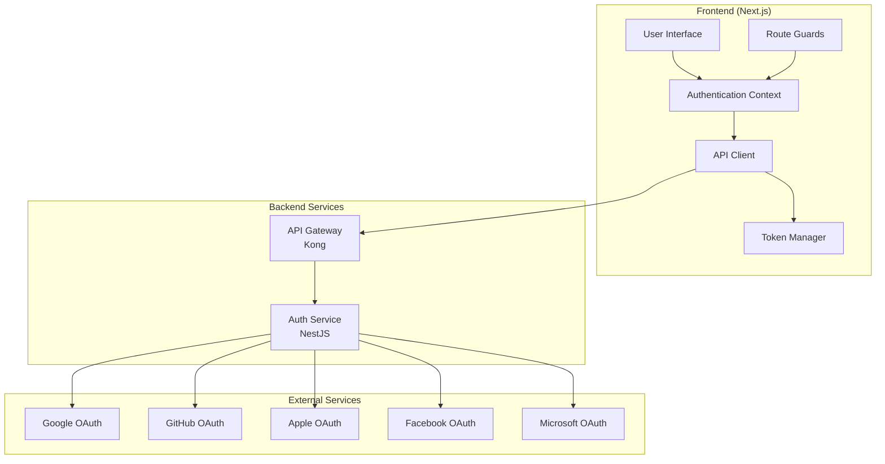
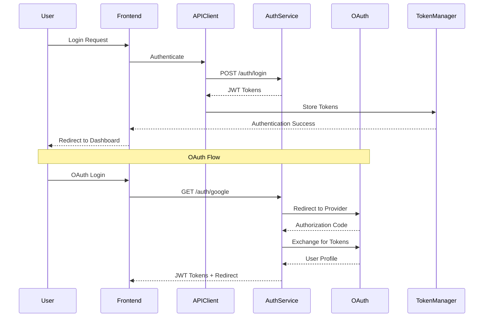

# Design Document

## Overview

This design document outlines the architecture for integrating the Next.js frontend with the existing NestJS auth-service microservice. The integration will replace the current NextAuth.js implementation with a direct communication layer that leverages all capabilities of the production-ready auth-service, including OAuth support for five providers, JWT token management, MFA, audit logging, and advanced security features.

## Architecture

### High-Level Architecture



### Communication Flow



## Components and Interfaces

### 1. HTTP Client Layer

**Purpose**: Centralized communication with auth-service with intelligent request handling.

**Key Features**:
- Singleton pattern for connection pooling
- Automatic token injection and refresh
- Circuit breaker for service degradation
- Request/response interceptors
- Correlation ID generation
- Exponential backoff retry logic

**Interface**:
```typescript
interface AuthServiceClient {
  // Authentication endpoints
  login(credentials: LoginCredentials): Promise<TokenPair>
  register(userData: RegisterData): Promise<TokenPair>
  refreshTokens(refreshToken: string): Promise<TokenPair>
  logout(): Promise<void>
  
  // Profile management
  getProfile(): Promise<UserProfile>
  updateProfile(updates: ProfileUpdates): Promise<UserProfile>
  
  // OAuth operations
  initiateOAuth(provider: OAuthProvider, redirectUrl?: string): Promise<OAuthInitiation>
  linkProvider(provider: OAuthProvider): Promise<void>
  unlinkProvider(provider: OAuthProvider): Promise<void>
  getLinkedProviders(): Promise<OAuthProvider[]>
  
  // Session management
  getSessions(): Promise<Session[]>
  invalidateSession(sessionId: string): Promise<void>
  
  // Health and configuration
  getHealth(): Promise<HealthStatus>
  getAvailableProviders(): Promise<OAuthProvider[]>
}
```

### 2. Token Management System

**Purpose**: Secure token storage and automatic refresh handling.

**Key Features**:
- Access tokens in memory only
- Refresh tokens in HTTP-only cookies
- Automatic refresh before expiration
- Token rotation with atomic updates
- Cross-tab synchronization

**Interface**:
```typescript
interface TokenManager {
  // Token operations
  storeTokens(tokens: TokenPair): Promise<void>
  getAccessToken(): Promise<string | null>
  refreshTokens(): Promise<TokenPair | null>
  clearTokens(): Promise<void>
  
  // Token validation
  isTokenValid(token: string): boolean
  getTokenExpiration(token: string): Date | null
  
  // Events
  onTokenRefresh(callback: (tokens: TokenPair) => void): void
  onTokenExpired(callback: () => void): void
}
```

### 3. Authentication Context

**Purpose**: Global authentication state management with React Context.

**Key Features**:
- Centralized authentication state
- Loading and error states
- User profile management
- Session timeout detection
- Multi-tab synchronization

**Interface**:
```typescript
interface AuthContextValue {
  // State
  user: User | null
  isLoading: boolean
  isAuthenticated: boolean
  error: AuthError | null
  
  // Actions
  login(credentials: LoginCredentials): Promise<void>
  register(userData: RegisterData): Promise<void>
  logout(): Promise<void>
  refreshSession(): Promise<void>
  
  // OAuth
  initiateOAuth(provider: OAuthProvider): Promise<void>
  linkProvider(provider: OAuthProvider): Promise<void>
  unlinkProvider(provider: OAuthProvider): Promise<void>
  
  // Utilities
  clearError(): void
  checkAuthStatus(): Promise<void>
}
```

### 4. Route Protection System

**Purpose**: Declarative route protection with authentication and authorization checks.

**Key Features**:
- Authentication requirement enforcement
- Role-based access control
- Redirect preservation
- Loading states during verification
- Unauthorized access handling

**Interface**:
```typescript
interface RouteGuardProps {
  children: React.ReactNode
  requireAuth?: boolean
  requireMentor?: boolean
  requireInsider?: boolean
  fallback?: React.ComponentType
  redirectTo?: string
}

interface RouteGuardHooks {
  useRequireAuth(redirectTo?: string): AuthContextValue
  useRequireMentor(): AuthContextValue
  useRequireInsider(): AuthContextValue
}
```

### 5. OAuth Integration Layer

**Purpose**: Seamless OAuth flow handling for all five providers.

**Key Features**:
- Provider-agnostic OAuth initiation
- Popup and redirect flow support
- State parameter management
- Error handling and recovery
- Account linking support

**Interface**:
```typescript
interface OAuthManager {
  // OAuth initiation
  initiateOAuth(provider: OAuthProvider, options?: OAuthOptions): Promise<void>
  
  // Callback handling
  handleCallback(code: string, state: string, provider: OAuthProvider): Promise<TokenPair>
  
  // State management
  generateState(redirectUrl?: string): string
  validateState(state: string): boolean
  
  // Provider management
  getAvailableProviders(): Promise<OAuthProvider[]>
  isProviderEnabled(provider: OAuthProvider): boolean
}
```

## Data Models

### Core Authentication Types

```typescript
interface User {
  id: number
  handle: string
  name?: string
  email: string
  avatarUrl: string
  reputation: string
  flair: Flair | null
  isMentor: boolean
  isInsider: boolean
  seniority?: 'beginner' | 'intermediate' | 'advanced' | 'expert'
  totalDonatedInDollars?: number
  createdAt?: string
  preferences: UserPreferences
  tracks: StudentTrack[]
}

interface TokenPair {
  accessToken: string
  refreshToken: string
  expiresIn: number
}

interface LoginCredentials {
  email: string
  password: string
}

interface RegisterData {
  email: string
  password: string
  countryCode: string
  timezone?: string
  language?: string
}

interface OAuthProvider {
  id: string
  name: string
  enabled: boolean
  iconUrl?: string
}

interface Session {
  id: string
  deviceInfo: string
  ipAddress: string
  lastActive: Date
  isCurrent: boolean
}
```

### Error Handling Types

```typescript
interface AuthError {
  type: 'network' | 'validation' | 'authentication' | 'authorization' | 'server'
  message: string
  code?: string
  details?: Record<string, any>
  recoverable: boolean
  retryAfter?: number
}

interface CircuitBreakerState {
  state: 'closed' | 'open' | 'half-open'
  failureCount: number
  lastFailureTime?: Date
  nextAttemptTime?: Date
}
```

## Error Handling

### Error Classification Strategy

1. **Network Errors**: Connection failures, timeouts, DNS issues
   - User Message: "Connection problem. Please check your internet connection."
   - Recovery: Automatic retry with exponential backoff

2. **Validation Errors**: Invalid input data, missing required fields
   - User Message: Field-specific validation messages
   - Recovery: User input correction required

3. **Authentication Errors**: Invalid credentials, expired tokens
   - User Message: "Invalid credentials. Please try again."
   - Recovery: Re-authentication required

4. **Authorization Errors**: Insufficient permissions, role restrictions
   - User Message: "You don't have permission to access this resource."
   - Recovery: Redirect to appropriate page

5. **Server Errors**: Auth-service internal errors, database issues
   - User Message: "Something went wrong. Please try again later."
   - Recovery: Automatic retry with circuit breaker

### Circuit Breaker Implementation

```typescript
interface CircuitBreakerConfig {
  failureThreshold: number // 5 failures
  recoveryTimeout: number  // 30 seconds
  monitoringPeriod: number // 60 seconds
}

class CircuitBreaker {
  private state: 'closed' | 'open' | 'half-open' = 'closed'
  private failureCount = 0
  private lastFailureTime?: Date
  private nextAttemptTime?: Date
  
  async execute<T>(operation: () => Promise<T>): Promise<T> {
    if (this.state === 'open') {
      if (Date.now() < this.nextAttemptTime!.getTime()) {
        throw new Error('Circuit breaker is open')
      }
      this.state = 'half-open'
    }
    
    try {
      const result = await operation()
      this.onSuccess()
      return result
    } catch (error) {
      this.onFailure()
      throw error
    }
  }
  
  private onSuccess(): void {
    this.failureCount = 0
    this.state = 'closed'
  }
  
  private onFailure(): void {
    this.failureCount++
    this.lastFailureTime = new Date()
    
    if (this.failureCount >= this.config.failureThreshold) {
      this.state = 'open'
      this.nextAttemptTime = new Date(Date.now() + this.config.recoveryTimeout)
    }
  }
}
```

## Testing Strategy

### Unit Testing

**Authentication Context Tests**:
- State management correctness
- Action dispatching and side effects
- Error handling and recovery
- Token refresh logic
- Multi-tab synchronization

**API Client Tests**:
- Request/response handling
- Token injection and refresh
- Circuit breaker behavior
- Retry logic with exponential backoff
- Error classification and mapping

**Token Manager Tests**:
- Secure token storage and retrieval
- Automatic refresh before expiration
- Token validation and expiration checking
- Cross-tab synchronization events
- Cleanup on logout

### Integration Testing

**Authentication Flow Tests**:
- Complete login/logout cycles
- OAuth flow for all five providers
- Token refresh during active sessions
- Session timeout and recovery
- Error scenarios and recovery

**Route Protection Tests**:
- Unauthenticated access prevention
- Role-based access control
- Redirect preservation and restoration
- Loading states during verification
- Error handling for authorization failures

### End-to-End Testing

**User Journey Tests**:
- Registration and email verification
- Login with email/password
- OAuth login for each provider
- Profile management operations
- Session management across tabs
- Account linking and unlinking

**Performance Tests**:
- Authentication flow latency
- Token refresh performance
- Concurrent user handling
- Memory usage optimization
- Bundle size impact measurement

## Security Considerations

### Token Security

1. **Access Token Storage**: Memory only, never localStorage
2. **Refresh Token Storage**: HTTP-only secure cookies
3. **Token Transmission**: HTTPS only with proper headers
4. **Token Rotation**: Automatic rotation on refresh
5. **Token Validation**: Client-side expiration checking

### Request Security

1. **CSRF Protection**: State parameters for OAuth flows
2. **Request Signing**: HMAC signatures for sensitive operations
3. **Correlation IDs**: Unique request tracking
4. **Rate Limiting**: Client-side request throttling
5. **Input Validation**: Sanitization before transmission

### Session Security

1. **Session Timeout**: Configurable inactivity timeout
2. **Activity Tracking**: Mouse, keyboard, scroll events
3. **Multi-tab Coordination**: Secure message passing
4. **Session Invalidation**: Immediate cleanup on logout
5. **Concurrent Session Limits**: Enforcement of session limits

## Performance Optimization

### Caching Strategy

1. **Memory Cache**: User profile and session data
2. **Session Storage**: Non-sensitive configuration data
3. **Cache Invalidation**: Event-driven cache updates
4. **Cache Versioning**: API version-aware caching
5. **Cache Warming**: Proactive data prefetching

### Request Optimization

1. **Request Batching**: Combine simultaneous requests
2. **Request Deduplication**: Prevent duplicate API calls
3. **Connection Pooling**: Persistent HTTP connections
4. **Compression**: Request/response compression
5. **Prefetching**: Predictive resource loading

### Bundle Optimization

1. **Code Splitting**: Authentication module separation
2. **Lazy Loading**: On-demand component loading
3. **Tree Shaking**: Unused code elimination
4. **Bundle Analysis**: Size monitoring and optimization
5. **Performance Budgets**: Automated size limits