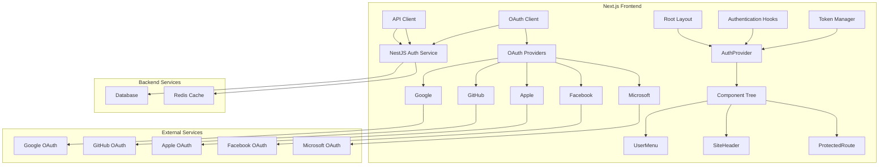
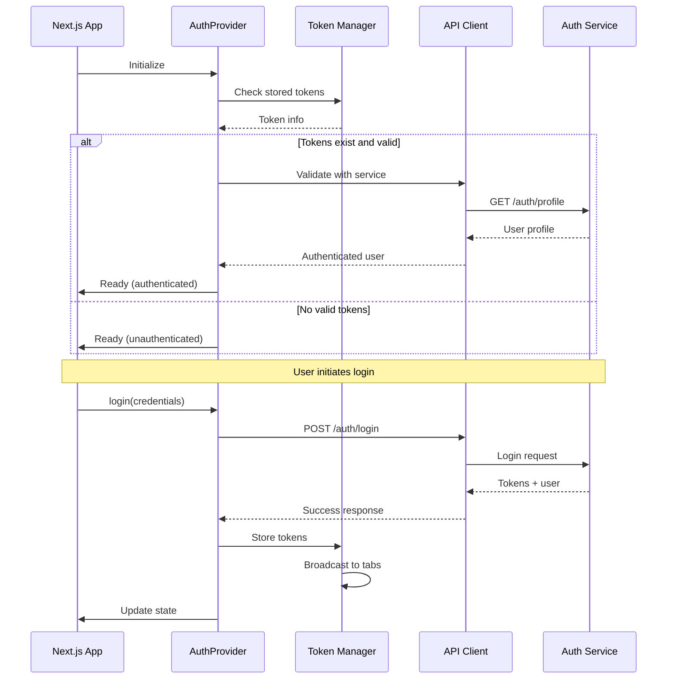
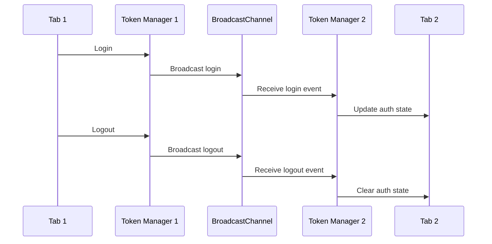

# Authentication Service Integration Design

## Overview

This design document outlines the comprehensive integration of a NestJS authentication microservice with a Next.js frontend application, replacing NextAuth.js with a sophisticated authentication system that provides seamless user experience, robust security, and excellent developer experience.

The integration leverages existing authentication infrastructure including AuthContext for state management, comprehensive authentication hooks for component integration, token management with cross-tab synchronization, OAuth client supporting five providers, and API client with circuit breaker pattern and error handling.

## Architecture

### High-Level Architecture



### Component Integration Flow



## Components and Interfaces

### 1. Root Provider Integration

**AuthProvider Replacement Strategy**

The root layout integration replaces NextAuth.js SessionProvider with AuthProvider from the existing AuthContext. This provider manages global authentication state and initializes the authentication system.

```typescript
// Before (NextAuth.js)
<SessionProvider session={session}>
  {children}
</SessionProvider>

// After (Auth Service Integration)
<AuthProvider>
  {children}
</AuthProvider>
```

**Key Integration Points:**
- Remove `getServerAuthSession` calls from layout
- Replace SessionProvider with AuthProvider at root level
- Initialize authentication state through AuthContext
- Handle server-side authentication through auth service utilities

**State Initialization Flow:**
1. AuthProvider mounts and checks for stored tokens
2. If tokens exist, validate with auth service
3. Fetch user profile if tokens are valid
4. Set authentication state based on validation result
5. Handle initialization errors gracefully

### 2. Layout Component Integration

**UserMenu Component Transformation**

The UserMenu component integration replaces NextAuth.js `useSession` with `useAuth` hook and `signOut` with AuthContext `logout` method.

```typescript
// Before (NextAuth.js)
const { data: session } = useSession()
const user = session?.user

const handleSignOut = () => {
  signOut({ callbackUrl: '/' })
}

// After (Auth Service Integration)
const { user, isAuthenticated, isLoading, logout } = useAuth()

const handleSignOut = async () => {
  await logout()
  // Redirect handled by AuthContext
}
```

**Integration Features:**
- Real-time authentication state updates
- Proper loading states during authentication operations
- Error handling with user-friendly messages
- Role-based menu item display using `isMentor` and `isInsider` flags
- Cross-tab logout synchronization

**SiteHeader Component Integration**

The SiteHeader component uses authentication state for conditional rendering of login/register buttons versus authenticated user interface.

```typescript
const { isAuthenticated, isLoading, user } = useAuth()

if (isLoading) {
  return <HeaderSkeleton />
}

return (
  <header>
    {isAuthenticated ? (
      <UserMenu user={user} />
    ) : (
      <AuthButtons />
    )}
  </header>
)
```

### 3. Route Protection System

**ProtectedRoute Component Architecture**

The route protection system uses specialized authentication hooks that provide automatic redirect handling, loading states, and role-based access control.

```typescript
// Basic authentication requirement
export function ProtectedRoute({ children, redirectTo = '/auth/signin' }) {
  const { shouldRender } = useRequireAuth({ redirectTo })
  
  if (!shouldRender) {
    return <LoadingSpinner />
  }
  
  return <>{children}</>
}

// Role-based protection
export function MentorProtectedRoute({ children }) {
  const { shouldRender } = useRequireMentor()
  
  if (!shouldRender) {
    return <LoadingSpinner />
  }
  
  return <>{children}</>
}
```

**Hook Integration Strategy:**
- `useRequireAuth`: Basic authentication with redirect
- `useRequireMentor`: Mentor role requirement with automatic redirect
- `useRequireInsider`: Insider role requirement with automatic redirect
- Automatic return URL preservation for post-login redirect
- Loading state management during authentication checks

**Middleware Integration**

Server-side route protection uses custom middleware that integrates with the auth service token validation system.

```typescript
export async function middleware(request: NextRequest) {
  const token = extractTokenFromRequest(request)
  
  if (!token || !isTokenValid(token)) {
    const loginUrl = new URL('/auth/signin', request.url)
    loginUrl.searchParams.set('callbackUrl', request.url)
    return NextResponse.redirect(loginUrl)
  }
  
  return NextResponse.next()
}
```

### 4. Server-Side Authentication Integration

**API Route Handler Integration**

Server-side authentication uses utilities from the auth service integration that communicate directly with the authentication microservice.

```typescript
// Before (NextAuth.js)
export async function GET(request: Request) {
  const session = await getServerSession(authOptions)
  if (!session?.user) {
    return new Response('Unauthorized', { status: 401 })
  }
  // Handle request
}

// After (Auth Service Integration)
export async function GET(request: Request) {
  try {
    const user = await requireAuth(request)
    // Handle authenticated request
  } catch (error) {
    return new Response('Unauthorized', { status: 401 })
  }
}
```

**Server-Side Utilities:**
- `getCurrentUser()`: Fetch authenticated user profile
- `isAuthenticated()`: Check authentication status
- `requireAuth()`: Enforce authentication with error throwing
- `requireMentor()`: Enforce mentor role requirement
- `requireInsider()`: Enforce insider role requirement

**Server Component Integration**

Server components that need authentication data use the auth service utilities to fetch user information.

```typescript
export default async function DashboardPage() {
  const user = await getCurrentUser()
  
  if (!user) {
    redirect('/auth/signin')
  }
  
  return <Dashboard user={user} />
}
```

### 5. OAuth Provider Integration

**OAuth Client Architecture**

The OAuth integration supports five providers (Google, GitHub, Apple, Facebook, Microsoft) with comprehensive state management, PKCE flow, and both popup and redirect flows.

```typescript
// OAuth initiation
const handleOAuthLogin = async (provider: OAuthProviderType) => {
  try {
    await initiateOAuth(provider)
    // Redirect handled by OAuth client
  } catch (error) {
    // Handle OAuth errors
  }
}

// OAuth callback handling
export async function GET(request: Request) {
  const { searchParams } = new URL(request.url)
  const code = searchParams.get('code')
  const state = searchParams.get('state')
  const provider = searchParams.get('provider') as OAuthProviderType
  
  try {
    const result = await handleOAuthCallback(provider, code, state)
    // Store tokens and redirect to callback URL
  } catch (error) {
    // Handle OAuth errors
  }
}
```

**OAuth Security Features:**
- PKCE (Proof Key for Code Exchange) flow implementation
- State parameter validation for CSRF protection
- Secure token exchange with auth service
- Provider-specific error handling
- Popup blocker detection and fallback

### 6. Token Management System

**Integrated Token Manager Architecture**

The token management system combines token storage, automatic refresh, and cross-tab synchronization into a unified interface.

```typescript
class IntegratedTokenManager {
  // Store tokens with cross-tab broadcast
  async storeTokens(tokens: TokenPair, user?: UserProfile): Promise<void>
  
  // Get valid access token with automatic refresh
  async getValidAccessToken(): Promise<string>
  
  // Clear tokens with cross-tab broadcast
  async clearTokens(): Promise<void>
  
  // Force token refresh
  async forceRefresh(): Promise<string>
  
  // Token validation
  isAccessTokenValid(): boolean
}
```

**Token Lifecycle Management:**
1. **Storage**: Secure token storage with appropriate expiration
2. **Validation**: Local token validation using JWT claims
3. **Refresh**: Automatic refresh before expiration
4. **Synchronization**: Cross-tab state synchronization using BroadcastChannel
5. **Cleanup**: Secure token cleanup on logout

**Cross-Tab Synchronization Flow:**



## Data Models

### Authentication State Model

```typescript
interface AuthState {
  // User data
  user: UserProfile | null
  
  // Authentication status
  isAuthenticated: boolean
  isInitialized: boolean
  
  // Loading states for different operations
  isLoading: boolean
  isLoginLoading: boolean
  isRegisterLoading: boolean
  isLogoutLoading: boolean
  isRefreshLoading: boolean
  isProfileLoading: boolean
  isOAuthLoading: boolean
  
  // Error states with classification
  error: AuthError | null
  loginError: AuthError | null
  registerError: AuthError | null
  profileError: AuthError | null
  oauthError: AuthError | null
  
  // Session information
  sessionInfo: {
    lastActivity: Date | null
    tokenExpiration: Date | null
    isSessionValid: boolean
  }
  
  // OAuth state
  oauthState: {
    provider: OAuthProviderType | null
    isInitiating: boolean
    redirectUrl: string | null
  }
}
```

### Token Management Model

```typescript
interface TokenPair {
  accessToken: string
  refreshToken: string
  expiresIn: number
  tokenType?: string
}

interface TokenInfo {
  hasAccessToken: boolean
  hasRefreshToken: boolean
  isAccessTokenValid: boolean
  accessTokenExpiration: Date | null
  refreshTokenExpiration: Date | null
}
```

### User Profile Model

```typescript
interface UserProfile {
  id: number
  handle: string
  name?: string
  email: string
  avatarUrl: string
  reputation: string
  flair: Flair | null
  isMentor: boolean
  isInsider: boolean
  seniority?: 'beginner' | 'intermediate' | 'advanced' | 'expert'
  totalDonatedInDollars?: number
  createdAt: string
  updatedAt: string
  preferences: UserPreferences
  tracks: StudentTrack[]
}
```

## Error Handling

### Error Classification System

The authentication system classifies errors into specific categories for appropriate handling:

```typescript
type AuthErrorType = 'network' | 'validation' | 'authentication' | 'authorization' | 'server' | 'oauth'

interface AuthError {
  type: AuthErrorType
  message: string
  code?: string
  details?: Record<string, unknown>
  recoverable: boolean
  retryAfter?: number
  field?: string // For validation errors
}
```

### Error Handling Strategy

**Network Errors:**
- Automatic retry with exponential backoff
- Circuit breaker pattern for service failures
- Graceful degradation when auth service is unavailable

**Authentication Errors:**
- Clear user-friendly messages
- Automatic redirect to login for expired sessions
- Account lockout handling with recovery options

**Validation Errors:**
- Field-specific error messages
- Form validation integration
- Real-time validation feedback

**OAuth Errors:**
- Provider-specific error handling
- Popup blocker detection and fallback
- State validation error handling

### Circuit Breaker Implementation

```typescript
class CircuitBreaker {
  private state: 'closed' | 'open' | 'half-open' = 'closed'
  private failureCount = 0
  private lastFailureTime?: Date
  private nextAttemptTime?: Date
  
  async execute<T>(operation: () => Promise<T>): Promise<T> {
    if (this.state === 'open') {
      if (this.shouldAttemptReset()) {
        this.state = 'half-open'
      } else {
        throw new Error('Circuit breaker is open')
      }
    }
    
    try {
      const result = await operation()
      this.onSuccess()
      return result
    } catch (error) {
      this.onFailure()
      throw error
    }
  }
}
```

## Testing Strategy

### Unit Testing Approach

**Component Testing:**
- Mock authentication hooks for isolated component testing
- Test component behavior with different authentication states
- Verify proper error handling and loading states

**Hook Testing:**
- Test authentication hooks with mocked AuthContext
- Verify redirect logic and URL preservation
- Test role-based access control logic

**Service Testing:**
- Mock API client for service layer testing
- Test token management operations
- Verify cross-tab synchronization logic

### Integration Testing Strategy

**Authentication Flow Testing:**
- End-to-end login and logout flows
- OAuth provider integration testing
- Token refresh and expiration handling
- Cross-tab synchronization verification

**Route Protection Testing:**
- Protected route access with different authentication states
- Role-based route protection verification
- Middleware integration testing

**Error Scenario Testing:**
- Network failure handling
- Auth service downtime scenarios
- Token expiration and refresh failures
- OAuth provider errors

### Performance Testing Considerations

**Load Testing:**
- Authentication service performance under load
- Token refresh concurrency handling
- Cross-tab synchronization performance

**Caching Effectiveness:**
- User profile data caching verification
- Token validation caching performance
- API client request deduplication

**Memory Usage:**
- Authentication state memory footprint
- Token storage memory usage
- Event listener cleanup verification

## Security Considerations

### Token Security

**Storage Security:**
- JWT tokens stored in localStorage with secure access patterns
- Refresh tokens with additional security measures
- Automatic token cleanup on logout

**Transmission Security:**
- HTTPS-only token transmission
- Secure token exchange in OAuth flows
- Protection against token interception

### Cross-Site Security

**XSS Protection:**
- Safe React rendering for user data
- Input sanitization for authentication forms
- Secure token handling in client-side code

**CSRF Protection:**
- OAuth state parameter validation
- Token-based authentication (inherently CSRF-resistant)
- Secure cookie configuration where applicable

### Session Security

**Session Management:**
- JWT token expiration enforcement
- Automatic session timeout handling
- Cross-tab logout synchronization

**Brute Force Protection:**
- Client-side rate limiting for login attempts
- Account lockout handling
- Progressive delay implementation

## Performance Optimization

### Caching Strategy

**User Profile Caching:**
- Time-based cache expiration (5 minutes)
- Cache invalidation on profile updates
- Shared cache across components

**Authentication Status Caching:**
- Short-term authentication status cache (1 minute)
- Token validation result caching
- Efficient cache key generation

### Request Optimization

**Request Deduplication:**
- Concurrent identical request deduplication
- Shared promise resolution
- Efficient request queuing

**Connection Optimization:**
- HTTP connection pooling
- Request prioritization
- Batch request optimization where possible

### React Performance

**Memoization Strategy:**
- Authentication hook memoization
- Stable reference generation for context values
- Efficient re-render prevention

**Component Optimization:**
- Lazy loading for authentication-dependent components
- Conditional rendering optimization
- Efficient state update patterns

## Migration Strategy

### Phased Rollout Plan

**Phase 1: Infrastructure Setup**
- Deploy AuthProvider at root level
- Implement feature flags for gradual rollout
- Set up monitoring and error tracking

**Phase 2: Component Integration**
- Migrate layout components (UserMenu, SiteHeader)
- Update route protection system
- Implement OAuth integration

**Phase 3: Server-Side Integration**
- Update API route handlers
- Migrate server components
- Implement custom middleware

**Phase 4: Cleanup and Optimization**
- Remove NextAuth.js dependencies
- Optimize performance based on metrics
- Complete testing and validation

### Rollback Strategy

**Rollback Preparation:**
- Maintain NextAuth.js configuration during transition
- Feature flag-based rollback capability
- Database migration rollback procedures

**Rollback Execution:**
- Quick revert to NextAuth.js configuration
- Session migration back to NextAuth.js format
- User notification and communication plan

This comprehensive design provides a robust foundation for replacing NextAuth.js with a sophisticated auth service integration that maintains security, performance, and user experience while providing excellent developer experience and maintainability.