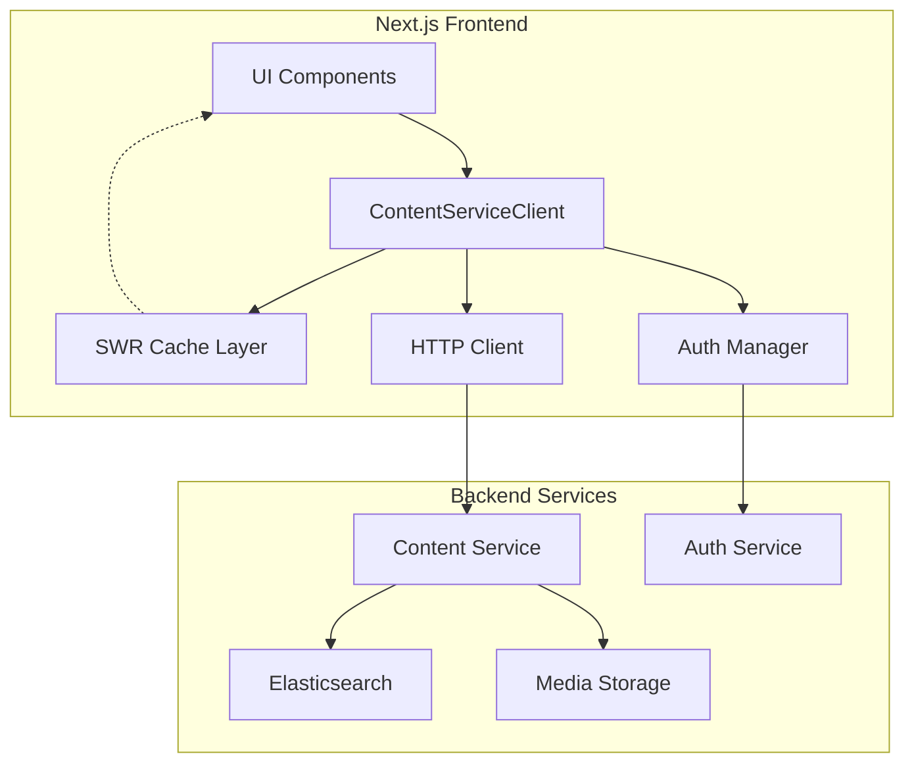
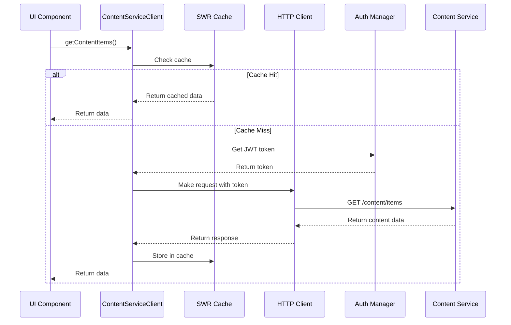

# Content Service Integration Design

## Overview

This design document outlines the architecture for integrating the content-service backend with the Next.js frontend application. The integration follows established patterns from the existing UserServiceClient and AuthServiceClient implementations, ensuring consistency and maintainability. The design emphasizes performance, reliability, and developer experience while providing comprehensive content management capabilities.

## Architecture

### High-Level Architecture



### Service Communication Flow



## Components and Interfaces

### ContentServiceClient Class

The main client class that provides a unified interface for all content-service operations:

```typescript
export class ContentServiceClient {
  // Core content operations
  async getContentItems(params?: QueryItemsDto): Promise<PaginatedResult<Item>>
  async getContentItem(id: string): Promise<Item>
  async createContentItem(data: CreateItemDto): Promise<Item>
  async updateContentItem(id: string, data: UpdateItemDto): Promise<Item>
  async deleteContentItem(id: string): Promise<void>
  
  // Media operations
  async uploadMedia(itemId: string, file: File, metadata: UploadMediaDto): Promise<MediaAsset>
  async getMediaAsset(id: string): Promise<MediaAsset>
  async getMediaSignedUrl(id: string, options?: SignedUrlOptions): Promise<string>
  
  // Search operations
  async searchContent(query: string, filters?: SearchFilters): Promise<SearchResult[]>
  async getSearchSuggestions(query: string): Promise<SearchSuggestion[]>
  async getRecommendations(userId: string, type: RecommendationType): Promise<Recommendation[]>
  
  // Workflow operations
  async submitForReview(id: string, data: SubmitForReviewDto): Promise<Item>
  async reviewContent(id: string, data: ReviewItemDto): Promise<Item>
  async publishContent(id: string, data: PublishItemDto): Promise<Item>
  
  // Bulk operations
  async bulkImport(data: BulkImportRequestDto): Promise<BulkImportResultDto>
  async bulkExport(data: BulkExportRequestDto): Promise<BulkExportResultDto>
  async getBulkOperationStatus(jobId: string): Promise<BulkOperationStatus>
}
```

### HTTP Client Integration

Leverages the existing HTTP client with content-service specific configuration:

```typescript
interface ContentServiceConfig {
  baseUrl: string
  timeout: number
  retryAttempts: number
  retryDelay: number
  circuitBreakerThreshold: number
  circuitBreakerTimeout: number
  enableRequestLogging: boolean
  enableMetrics: boolean
}
```

### Authentication Integration

Integrates with existing authentication mechanisms:

```typescript
interface AuthenticationIntegration {
  tokenProvider: () => Promise<string>
  tokenRefresh: (refreshToken: string) => Promise<TokenPair>
  onAuthError: (error: AuthError) => void
  onTokenExpired: () => void
}
```

### Caching Strategy

Implements multi-layered caching using SWR:

```typescript
interface CacheConfiguration {
  defaultTTL: number // 10 minutes for content
  searchTTL: number // 5 minutes for search results
  mediaTTL: number // 1 hour for media metadata
  revalidateOnFocus: boolean
  revalidateOnReconnect: boolean
  dedupingInterval: number
}
```

## Data Models

### Core Content Types

```typescript
interface ContentItem {
  id: string
  title: string
  slug: string
  content: ContentData
  type: ContentType
  status: WorkflowStatus
  metadata: ContentMetadata
  mediaAssets: MediaAsset[]
  tags: string[]
  createdAt: Date
  updatedAt: Date
  createdBy: string
  updatedBy: string
}

interface MediaAsset {
  id: string
  itemId: string
  filename: string
  originalName: string
  mimeType: string
  size: number
  url: string
  cdnUrl?: string
  metadata: MediaMetadata
  createdAt: Date
}

interface SearchResult {
  item: ContentItem
  score: number
  highlights: SearchHighlight[]
  facets: SearchFacet[]
}
```

### Request/Response DTOs

```typescript
interface CreateItemDto {
  title: string
  content: ContentData
  type: ContentType
  tags?: string[]
  metadata?: Partial<ContentMetadata>
}

interface QueryItemsDto {
  page?: number
  limit?: number
  type?: ContentType
  status?: WorkflowStatus
  tags?: string[]
  search?: string
  sortBy?: string
  sortOrder?: 'asc' | 'desc'
}

interface PaginatedResult<T> {
  items: T[]
  total: number
  page: number
  limit: number
  totalPages: number
}
```

## Error Handling

### Error Classification

```typescript
type ContentServiceError = 
  | NetworkError
  | ValidationError
  | AuthenticationError
  | AuthorizationError
  | NotFoundError
  | ConflictError
  | ServerError
  | TimeoutError

interface ContentServiceErrorContext {
  operation: string
  itemId?: string
  userId?: string
  correlationId: string
  timestamp: Date
  retryable: boolean
  retryAfter?: number
}
```

### Error Recovery Strategies

1. **Network Errors**: Retry with exponential backoff (3 attempts)
2. **Authentication Errors**: Attempt token refresh, redirect to login if failed
3. **Validation Errors**: Display field-specific error messages
4. **Server Errors**: Show generic error message, log details for debugging
5. **Timeout Errors**: Retry with increased timeout

### Circuit Breaker Implementation

```typescript
interface CircuitBreakerConfig {
  failureThreshold: 5
  recoveryTimeout: 30000
  monitoringPeriod: 60000
  halfOpenMaxCalls: 3
}
```

## Testing Strategy

### Unit Testing

- **ContentServiceClient Methods**: Test all CRUD operations with mocked HTTP responses
- **Error Handling**: Verify proper error classification and recovery
- **Caching Logic**: Test cache hits, misses, and invalidation
- **Authentication Integration**: Test token attachment and refresh flows

### Integration Testing

- **API Contract Testing**: Verify request/response formats match backend expectations
- **Authentication Flow**: Test end-to-end authentication with real tokens
- **Error Scenarios**: Test network failures, timeouts, and server errors
- **Performance Testing**: Verify caching effectiveness and request optimization

### End-to-End Testing

- **Content Management Workflows**: Test complete user journeys for content creation, editing, and publishing
- **Media Upload Flows**: Test file uploads with various file types and sizes
- **Search Functionality**: Test search queries, filters, and result display
- **Bulk Operations**: Test import/export workflows with progress tracking

## Performance Optimizations

### Request Optimization

1. **Request Deduplication**: Prevent duplicate requests for the same resource
2. **Request Batching**: Combine multiple related requests where possible
3. **Connection Pooling**: Reuse HTTP connections for better performance
4. **Compression**: Enable gzip compression for request/response bodies

### Caching Strategy

1. **SWR Integration**: Stale-while-revalidate for optimal user experience
2. **Cache Invalidation**: Smart invalidation based on content relationships
3. **Prefetching**: Preload related content during idle time
4. **Optimistic Updates**: Update UI immediately, reconcile with server response

### Media Optimization

1. **Client-side Compression**: Compress images before upload
2. **Progressive Upload**: Chunked uploads for large files with resume capability
3. **CDN Integration**: Serve media assets from CDN for faster delivery
4. **Lazy Loading**: Load media assets only when needed

## Security Considerations

### Authentication Security

- JWT tokens stored securely in HTTP-only cookies
- Automatic token refresh before expiration
- Secure token transmission over HTTPS only
- Token validation on every request

### Request Security

- Request signing for sensitive operations
- CSRF protection for state-changing requests
- Input validation and sanitization
- Rate limiting to prevent abuse

### Data Security

- Sensitive data encryption in transit and at rest
- Access control based on user roles and permissions
- Audit logging for all content modifications
- Secure file upload validation

## Monitoring and Observability

### Metrics Collection

```typescript
interface ContentServiceMetrics {
  requestCount: number
  successRate: number
  averageResponseTime: number
  errorsByType: Record<string, number>
  cacheHitRate: number
  activeConnections: number
}
```

### Performance Monitoring

- Request duration tracking
- Cache performance metrics
- Error rate monitoring
- User experience metrics (Core Web Vitals)

### Logging Strategy

- Structured logging with correlation IDs
- Error logging with stack traces
- Performance logging for slow requests
- User action logging for analytics

## Deployment Considerations

### Environment Configuration

```typescript
interface EnvironmentConfig {
  NEXT_PUBLIC_CONTENT_SERVICE_URL: string
  CONTENT_SERVICE_TIMEOUT: number
  CONTENT_SERVICE_RETRY_ATTEMPTS: number
  CONTENT_SERVICE_CACHE_TTL: number
  CONTENT_SERVICE_ENABLE_METRICS: boolean
}
```

### Feature Flags

- Gradual rollout of content-service integration
- A/B testing for different caching strategies
- Emergency disable switches for problematic features
- Beta feature access for specific user groups

### Scalability Planning

- Horizontal scaling support for multiple frontend instances
- Load balancing across content-service instances
- Database connection pooling and optimization
- CDN configuration for global content delivery

## Migration Strategy

### Phase 1: Foundation (Week 1-2)
- Implement ContentServiceClient class
- Set up authentication integration
- Create basic CRUD operations
- Implement error handling framework

### Phase 2: Core Features (Week 3-4)
- Add media upload functionality
- Implement search integration
- Set up caching layer
- Add workflow operations

### Phase 3: Advanced Features (Week 5-6)
- Implement bulk operations
- Add real-time updates
- Performance optimizations
- Comprehensive testing

### Phase 4: Production Readiness (Week 7-8)
- Security hardening
- Monitoring and alerting
- Documentation completion
- Production deployment

## Risk Mitigation

### Technical Risks

1. **Performance Degradation**: Mitigated by comprehensive caching and request optimization
2. **Authentication Failures**: Mitigated by robust token management and fallback mechanisms
3. **Data Consistency**: Mitigated by optimistic updates with conflict resolution
4. **Service Unavailability**: Mitigated by circuit breaker pattern and graceful degradation

### Operational Risks

1. **Deployment Issues**: Mitigated by feature flags and gradual rollout
2. **Data Migration**: Mitigated by parallel running and validation
3. **User Experience**: Mitigated by extensive testing and monitoring
4. **Security Vulnerabilities**: Mitigated by security reviews and automated scanning