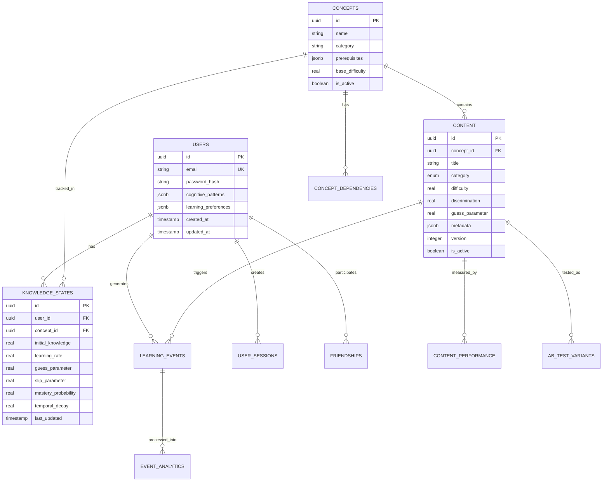

# DriveMaster Platform Design Document

## Overview

DriveMaster is architected as a high-performance, microservices-based adaptive learning platform designed to handle 100,000+ concurrent users with sub-100ms response times and 99.99% uptime. The system leverages advanced machine learning algorithms for personalized learning experiences while maintaining production-grade reliability, security, and scalability.

The architecture follows a backend-heavy approach (80% server-side functionality) with intelligent caching, real-time event processing, and offline-capable mobile clients. The platform uses modern technologies including Node.js with Fastify, PostgreSQL with Drizzle ORM, Redis Stack, Apache Kafka, and Elasticsearch for optimal performance and developer experience.

## Architecture

### High-Level System Architecture


### Technology Stack Selection

**Backend Framework:** Fastify over Express for 2-3x better performance, built-in schema validation, and lower memory footprint. Fastify's plugin architecture aligns perfectly with microservices design.

**ORM Choice:** Drizzle ORM over Prisma for better TypeScript integration, zero-runtime overhead, and superior performance with complex queries. Drizzle's query builder provides more control over SQL generation.

**Database Strategy:** PostgreSQL 16+ with advanced partitioning, JSONB for flexible schemas, and read replicas for scaling. Connection pooling via PgBouncer for handling high concurrency.

**Caching Architecture:** Redis Stack for multi-purpose caching, session management, vector operations, and real-time feature storage. Implements intelligent cache invalidation and warming strategies.

**Event Streaming:** Apache Kafka for real-time analytics, ML pipeline processing, and inter-service communication. Provides durability and replay capabilities for ML model training.

## Components and Interfaces

### 1. User Management Service

**Core Responsibilities:**

- OAuth 2.0 authentication with JWT token management
- User profile and cognitive pattern storage
- Social features and friend connections
- Progress tracking and analytics aggregation

**Key Interfaces:**

```typescript
// Authentication Interface
interface AuthService {
  authenticate(credentials: LoginCredentials): Promise<AuthResult>
  refreshToken(token: string): Promise<TokenPair>
  validateToken(token: string): Promise<UserContext>
  revokeToken(token: string): Promise<void>
}

// User Profile Interface
interface UserProfileService {
  createProfile(userData: CreateUserRequest): Promise<UserProfile>
  updateCognitivePatterns(userId: string, patterns: CognitivePatterns): Promise<void>
  getLearningPreferences(userId: string): Promise<LearningPreferences>
  updateProgress(userId: string, progress: ProgressUpdate): Promise<void>
}

// Social Features Interface
interface SocialService {
  addFriend(userId: string, friendId: string): Promise<FriendshipResult>
  getLeaderboard(userId: string, scope: LeaderboardScope): Promise<LeaderboardData>
  shareProgress(userId: string, achievement: Achievement): Promise<ShareResult>
}
```

**Database Schema (Drizzle):**

```typescript
export const users = pgTable(
  'users',
  {
    id: uuid('id').primaryKey().defaultRandom(),
    email: varchar('email', { length: 255 }).unique().notNull(),
    passwordHash: varchar('password_hash', { length: 255 }).notNull(),
    cognitivePatterns: jsonb('cognitive_patterns').$type<CognitivePatterns>(),
    learningPreferences: jsonb('learning_preferences').$type<LearningPreferences>(),
    createdAt: timestamp('created_at').defaultNow(),
    updatedAt: timestamp('updated_at').defaultNow(),
  },
  (table) => ({
    emailIdx: index('users_email_idx').on(table.email),
    cognitiveIdx: index('users_cognitive_idx').using('gin', table.cognitivePatterns),
  }),
)
```

### 2. Adaptive Learning Engine Service

**Core Responsibilities:**

- Bayesian Knowledge Tracing implementation
- Multi-Armed Bandit question selection
- Personalized spaced repetition scheduling
- Item Response Theory calibration

**Advanced ML Algorithms Implementation:**

```typescript
// Bayesian Knowledge Tracing Interface
interface BayesianKnowledgeTracing {
  updateKnowledgeState(
    userId: string,
    conceptId: string,
    response: UserResponse,
  ): Promise<KnowledgeState>

  predictMastery(userId: string, conceptId: string): Promise<MasteryProbability>

  getConceptDependencies(conceptId: string): Promise<ConceptDependency[]>
}

// Multi-Armed Bandit Interface
interface MultiArmedBandit {
  selectOptimalQuestion(userId: string, context: LearningContext): Promise<QuestionSelection>

  updateRewardModel(userId: string, questionId: string, outcome: LearningOutcome): Promise<void>

  balanceExplorationExploitation(userId: string, availableQuestions: Question[]): Promise<Question>
}

// Spaced Repetition Interface
interface SpacedRepetitionEngine {
  calculateNextReview(
    userId: string,
    conceptId: string,
    performance: PerformanceMetrics,
  ): Promise<ReviewSchedule>

  optimizeReviewTiming(
    userId: string,
    userAvailability: AvailabilityPattern,
  ): Promise<OptimalSchedule>

  adjustForForgettingCurve(
    userId: string,
    historicalData: HistoricalPerformance[],
  ): Promise<PersonalizedCurve>
}
```

**Knowledge State Management:**

```typescript
export const knowledgeStates = pgTable(
  'knowledge_states',
  {
    id: uuid('id').primaryKey().defaultRandom(),
    userId: uuid('user_id').references(() => users.id),
    conceptId: uuid('concept_id').references(() => concepts.id),
    initialKnowledge: real('initial_knowledge').notNull(),
    learningRate: real('learning_rate').notNull(),
    guessParameter: real('guess_parameter').notNull(),
    slipParameter: real('slip_parameter').notNull(),
    masteryProbability: real('mastery_probability').notNull(),
    lastUpdated: timestamp('last_updated').defaultNow(),
    temporalDecay: real('temporal_decay').default(0.95),
  },
  (table) => ({
    userConceptIdx: uniqueIndex('knowledge_states_user_concept_idx').on(
      table.userId,
      table.conceptId,
    ),
    masteryIdx: index('knowledge_states_mastery_idx').on(table.masteryProbability),
  }),
).partition('user_id') // Partition by user_id for horizontal scaling
```

### 3. Content Management Service

**Core Responsibilities:**

- Hierarchical content organization
- Content versioning and A/B testing
- Multimedia content delivery optimization
- Performance analytics and optimization

**Content Architecture:**

```typescript
// Content Management Interface
interface ContentService {
  getAdaptiveContent(userId: string, learningContext: LearningContext): Promise<AdaptiveContent>

  trackContentPerformance(contentId: string, userInteraction: ContentInteraction): Promise<void>

  optimizeContentDelivery(
    deviceCapabilities: DeviceCapabilities,
    networkConditions: NetworkConditions,
  ): Promise<OptimizedContent>
}

// A/B Testing Interface
interface ABTestingService {
  assignVariant(userId: string, experimentId: string): Promise<ContentVariant>
  trackConversion(userId: string, experimentId: string, outcome: Outcome): Promise<void>
  analyzeExperimentResults(experimentId: string): Promise<ExperimentResults>
}
```

**Content Schema with Versioning:**

```typescript
export const content = pgTable(
  'content',
  {
    id: uuid('id').primaryKey().defaultRandom(),
    title: varchar('title', { length: 255 }).notNull(),
    category: contentCategoryEnum('category').notNull(),
    difficulty: real('difficulty').notNull(),
    discrimination: real('discrimination').notNull(),
    guessParameter: real('guess_parameter').notNull(),
    version: integer('version').default(1),
    isActive: boolean('is_active').default(true),
    metadata: jsonb('metadata').$type<ContentMetadata>(),
    createdAt: timestamp('created_at').defaultNow(),
  },
  (table) => ({
    categoryDifficultyIdx: index('content_category_difficulty_idx').on(
      table.category,
      table.difficulty,
    ),
    activeContentIdx: index('content_active_idx').on(table.isActive),
  }),
)

export const contentPerformance = pgTable(
  'content_performance',
  {
    id: uuid('id').primaryKey().defaultRandom(),
    contentId: uuid('content_id').references(() => content.id),
    userId: uuid('user_id').references(() => users.id),
    responseTime: integer('response_time').notNull(),
    isCorrect: boolean('is_correct').notNull(),
    confidenceLevel: real('confidence_level'),
    timestamp: timestamp('timestamp').defaultNow(),
  },
  (table) => ({
    contentUserIdx: index('content_performance_content_user_idx').on(table.contentId, table.userId),
    timestampIdx: index('content_performance_timestamp_idx').on(table.timestamp),
  }),
).partition('timestamp') // Time-series partitioning
```

### 4. Real-Time Analytics Service

**Core Responsibilities:**

- Real-time event processing via Kafka
- Predictive analytics for dropout prevention
- Behavioral pattern recognition
- Performance dashboard generation

**Analytics Architecture:**

```typescript
// Real-time Analytics Interface
interface AnalyticsService {
  processLearningEvent(event: LearningEvent): Promise<void>
  detectDropoutRisk(userId: string): Promise<DropoutRiskAssessment>
  identifyLearningPatterns(userId: string): Promise<LearningPatterns>
  generateInsights(userId: string): Promise<PersonalizedInsights>
}

// Event Processing Interface
interface EventProcessor {
  processEventStream(eventStream: KafkaStream<LearningEvent>): void
  aggregateUserMetrics(userId: string, timeWindow: TimeWindow): Promise<UserMetrics>
  detectAnomalies(userBehavior: UserBehavior): Promise<AnomalyDetection>
}
```

**Event Schema and Processing:**

```typescript
export const learningEvents = pgTable(
  'learning_events',
  {
    id: uuid('id').primaryKey().defaultRandom(),
    userId: uuid('user_id').references(() => users.id),
    eventType: eventTypeEnum('event_type').notNull(),
    contentId: uuid('content_id').references(() => content.id),
    sessionId: uuid('session_id').notNull(),
    responseData: jsonb('response_data').$type<ResponseData>(),
    contextData: jsonb('context_data').$type<ContextData>(),
    timestamp: timestamp('timestamp').defaultNow(),
    processingStatus: processingStatusEnum('processing_status').default('pending'),
  },
  (table) => ({
    userTimestampIdx: index('learning_events_user_timestamp_idx').on(table.userId, table.timestamp),
    sessionIdx: index('learning_events_session_idx').on(table.sessionId),
    processingIdx: index('learning_events_processing_idx').on(table.processingStatus),
  }),
).partition('timestamp') // Partition by month for efficient time-series queries
```

### 5. Engagement and Notification Service

**Core Responsibilities:**

- Intelligent push notification delivery
- Gamification system management
- Social feature coordination
- Real-time engagement tracking

**Engagement Interfaces:**

```typescript
// Notification Service Interface
interface NotificationService {
  schedulePersonalizedNotification(
    userId: string,
    notificationType: NotificationType,
    context: NotificationContext,
  ): Promise<NotificationSchedule>

  optimizeDeliveryTiming(
    userId: string,
    userActivityPattern: ActivityPattern,
  ): Promise<OptimalTiming>

  trackEngagementMetrics(notificationId: string, engagement: EngagementMetrics): Promise<void>
}

// Gamification Interface
interface GamificationService {
  calculateXPReward(
    userId: string,
    achievement: Achievement,
    context: LearningContext,
  ): Promise<XPReward>

  updateStreakStatus(userId: string, activity: UserActivity): Promise<StreakStatus>

  processAchievement(userId: string, milestone: Milestone): Promise<AchievementResult>
}
```

## Data Models

### Core Entity Relationships



### Advanced Schema Optimizations

**Partitioning Strategy:**

- `knowledge_states`: Partitioned by `user_id` for horizontal scaling
- `learning_events`: Partitioned by `timestamp` (monthly) for time-series efficiency
- `content_performance`: Partitioned by `timestamp` for analytics optimization

**Indexing Strategy:**

- Composite indexes on frequently queried combinations
- GIN indexes on JSONB columns for flexible queries
- Partial indexes on active records only
- Covering indexes to avoid table lookups

**Connection Pooling Configuration:**

```typescript
// Database connection configuration
export const dbConfig = {
  host: process.env.DB_HOST,
  port: parseInt(process.env.DB_PORT || '5432'),
  database: process.env.DB_NAME,
  user: process.env.DB_USER,
  password: process.env.DB_PASSWORD,
  max: 20, // Maximum connections in pool
  idleTimeoutMillis: 30000,
  connectionTimeoutMillis: 2000,
  // Read replica configuration
  readReplicas: [{ host: process.env.DB_READ_REPLICA_1 }, { host: process.env.DB_READ_REPLICA_2 }],
}
```

## Error Handling

### Comprehensive Error Management Strategy

**Error Classification System:**

```typescript
// Error hierarchy for consistent handling
abstract class DriveMasterError extends Error {
  abstract readonly code: string
  abstract readonly statusCode: number
  abstract readonly isRetryable: boolean
}

class ValidationError extends DriveMasterError {
  readonly code = 'VALIDATION_ERROR'
  readonly statusCode = 400
  readonly isRetryable = false
}

class AuthenticationError extends DriveMasterError {
  readonly code = 'AUTH_ERROR'
  readonly statusCode = 401
  readonly isRetryable = false
}

class RateLimitError extends DriveMasterError {
  readonly code = 'RATE_LIMIT_ERROR'
  readonly statusCode = 429
  readonly isRetryable = true
}

class ServiceUnavailableError extends DriveMasterError {
  readonly code = 'SERVICE_UNAVAILABLE'
  readonly statusCode = 503
  readonly isRetryable = true
}
```

**Circuit Breaker Implementation:**

```typescript
interface CircuitBreakerConfig {
  failureThreshold: number
  recoveryTimeout: number
  monitoringPeriod: number
}

class CircuitBreaker {
  private state: 'CLOSED' | 'OPEN' | 'HALF_OPEN' = 'CLOSED'
  private failureCount = 0
  private lastFailureTime?: Date

  async execute<T>(operation: () => Promise<T>): Promise<T> {
    if (this.state === 'OPEN') {
      if (this.shouldAttemptReset()) {
        this.state = 'HALF_OPEN'
      } else {
        throw new ServiceUnavailableError('Circuit breaker is OPEN')
      }
    }

    try {
      const result = await operation()
      this.onSuccess()
      return result
    } catch (error) {
      this.onFailure()
      throw error
    }
  }
}
```

**Graceful Degradation Strategies:**

```typescript
// Fallback mechanisms for critical services
interface FallbackStrategy<T> {
  primary: () => Promise<T>
  fallback: () => Promise<T>
  shouldUseFallback: (error: Error) => boolean
}

class AdaptiveLearningFallback implements FallbackStrategy<Question> {
  async primary(): Promise<Question> {
    return this.mlBasedSelection()
  }

  async fallback(): Promise<Question> {
    // Fallback to rule-based selection when ML service is unavailable
    return this.ruleBasedSelection()
  }

  shouldUseFallback(error: Error): boolean {
    return error instanceof ServiceUnavailableError || error instanceof TimeoutError
  }
}
```

## Testing Strategy

### Multi-Layer Testing Approach

**Unit Testing (80%+ Coverage):**

- Jest with TypeScript for comprehensive unit testing
- Property-based testing with fast-check for ML algorithms
- Mocking strategies for external dependencies
- Performance benchmarking for critical algorithms

**Integration Testing:**

- Testcontainers for database integration tests
- Kafka test harness for event processing validation
- Redis integration testing with embedded Redis
- API contract testing with Pact

**End-to-End Testing:**

- Playwright for mobile app testing
- Load testing with k6 for performance validation
- Chaos engineering with Chaos Monkey
- Security testing with OWASP ZAP

**ML Algorithm Testing:**

```typescript
// Bayesian Knowledge Tracing validation
describe('BayesianKnowledgeTracing', () => {
  it('should converge to correct mastery probability', async () => {
    const bkt = new BayesianKnowledgeTracing()
    const userId = 'test-user'
    const conceptId = 'traffic-signs'

    // Simulate correct responses
    for (let i = 0; i < 10; i++) {
      await bkt.updateKnowledgeState(userId, conceptId, {
        isCorrect: true,
        responseTime: 2000,
        confidence: 0.9,
      })
    }

    const mastery = await bkt.predictMastery(userId, conceptId)
    expect(mastery.probability).toBeGreaterThan(0.8)
  })
})

// Multi-Armed Bandit testing
describe('MultiArmedBandit', () => {
  it('should balance exploration and exploitation', async () => {
    const mab = new MultiArmedBandit()
    const selections = []

    for (let i = 0; i < 100; i++) {
      const question = await mab.selectOptimalQuestion(userId, context)
      selections.push(question.id)
    }

    // Verify exploration (variety) and exploitation (best performers)
    const uniqueQuestions = new Set(selections).size
    expect(uniqueQuestions).toBeGreaterThan(5) // Exploration
    expect(selections.filter((id) => id === bestQuestionId).length).toBeGreaterThan(20) // Exploitation
  })
})
```

**Performance Testing Configuration:**

```typescript
// k6 load testing script
export const options = {
  stages: [
    { duration: '2m', target: 100 }, // Ramp up
    { duration: '5m', target: 100 }, // Stay at 100 users
    { duration: '2m', target: 200 }, // Ramp up to 200 users
    { duration: '5m', target: 200 }, // Stay at 200 users
    { duration: '2m', target: 0 }, // Ramp down
  ],
  thresholds: {
    http_req_duration: ['p(95)<100'], // 95% of requests under 100ms
    http_req_failed: ['rate<0.01'], // Error rate under 1%
  },
}
```

This design document provides a comprehensive technical blueprint for building the DriveMaster platform with production-grade architecture, advanced ML capabilities, and enterprise-level reliability. The design emphasizes performance optimization, scalability, and maintainability while incorporating modern development practices and proven architectural patterns.
