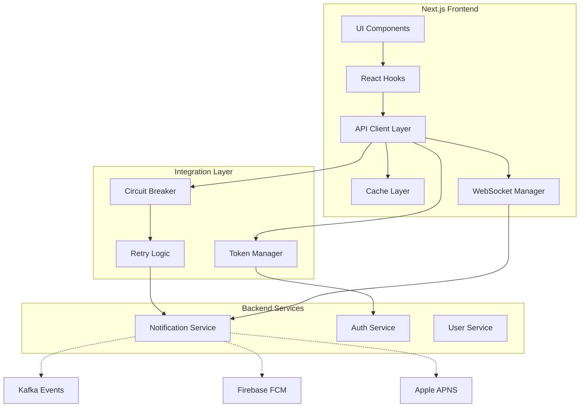

# Notification Service Integration Design

## Overview

This design document outlines the architecture for integrating the existing NestJS notification microservice with the Next.js frontend. The integration follows established patterns from the existing auth-service and user-service integrations, ensuring consistency, reliability, and maintainability. The design emphasizes performance, real-time capabilities, comprehensive error handling, and seamless user experience.

## Architecture

### High-Level Architecture



### Service Integration Pattern

Following the established pattern from auth-service and user-service integrations:

```
apps/web-app/src/
├── lib/
│   └── notification-service/
│       ├── index.ts                    # Main exports
│       ├── api-client.ts              # Core API client
│       ├── websocket-client.ts        # Real-time communication
│       ├── circuit-breaker.ts         # Resilience patterns
│       ├── error-handler.ts           # Error handling
│       ├── cache-manager.ts           # Caching strategies
│       └── config.ts                  # Configuration
├── hooks/
│   ├── useNotifications.ts            # Core notification hooks
│   ├── useDeviceTokens.ts            # Device management hooks
│   ├── useNotificationPreferences.ts  # Preferences hooks
│   └── useRealtimeNotifications.ts    # Real-time hooks
├── types/
│   └── notification-service.ts        # TypeScript definitions
└── components/
    └── notifications/
        ├── NotificationCenter.tsx      # Main notification UI
        ├── NotificationList.tsx        # Enhanced list component
        ├── NotificationPreferences.tsx # Settings UI
        └── PushPermissionFlow.tsx      # Permission management
```

## Components and Interfaces

### 1. API Client Layer

#### NotificationApiClient Class

```typescript
export class NotificationApiClient {
  private httpClient: AxiosInstance
  private circuitBreaker: CircuitBreaker
  private cache: CacheManager
  
  // Core CRUD operations
  async getNotifications(params: NotificationQueryParams): Promise<NotificationList>
  async markAsRead(notificationId: string): Promise<void>
  async markAllAsRead(userId: string): Promise<void>
  async deleteNotification(notificationId: string): Promise<void>
  
  // Device token management
  async registerDeviceToken(token: DeviceTokenRequest): Promise<void>
  async getDeviceTokens(userId: string): Promise<DeviceToken[]>
  async removeDeviceToken(tokenId: string): Promise<void>
  
  // Template operations
  async getTemplates(type?: NotificationType): Promise<NotificationTemplate[]>
  async renderTemplate(templateId: string, data: Record<string, any>): Promise<RenderedNotification>
  
  // Scheduling operations
  async scheduleNotification(notification: ScheduleNotificationRequest): Promise<ScheduledNotification>
  async cancelScheduledNotification(notificationId: string): Promise<void>
  async getScheduledNotifications(userId: string): Promise<ScheduledNotification[]>
  
  // Analytics operations
  async trackDelivery(notificationId: string, result: DeliveryResult): Promise<void>
  async trackOpen(notificationId: string, userId: string): Promise<void>
  async trackClick(notificationId: string, userId: string, action?: string): Promise<void>
  async getAnalytics(params: AnalyticsQueryParams): Promise<NotificationAnalytics>
  
  // Preferences management
  async getPreferences(userId: string): Promise<NotificationPreferences>
  async updatePreferences(userId: string, preferences: Partial<NotificationPreferences>): Promise<void>
  
  // Specialized learning notifications
  async sendAchievementNotification(request: AchievementNotificationRequest): Promise<void>
  async scheduleSpacedRepetitionReminder(request: SpacedRepetitionRequest): Promise<void>
  async scheduleStreakReminder(request: StreakReminderRequest): Promise<void>
  async scheduleMockTestReminder(request: MockTestReminderRequest): Promise<void>
}
```

#### WebSocket Client for Real-Time Communication

```typescript
export class NotificationWebSocketClient {
  private ws: WebSocket | null = null
  private reconnectAttempts = 0
  private subscriptions = new Map<string, EventHandler>()
  
  async connect(userId: string): Promise<void>
  async disconnect(): Promise<void>
  
  subscribe(eventType: NotificationEventType, handler: EventHandler): string
  unsubscribe(subscriptionId: string): void
  
  private handleMessage(event: MessageEvent): void
  private handleReconnection(): void
  private authenticateConnection(): Promise<void>
}
```

### 2. React Hooks Layer

#### Core Notification Hooks

```typescript
// Primary notification management hook
export function useNotifications(params?: NotificationQueryParams) {
  return useQuery({
    queryKey: ['notifications', params],
    queryFn: () => notificationApiClient.getNotifications(params),
    staleTime: 30000, // 30 seconds
    refetchOnWindowFocus: true,
    refetchInterval: 60000, // 1 minute background refresh
  })
}

// Notification mutations
export function useNotificationMutations() {
  const queryClient = useQueryClient()
  
  const markAsRead = useMutation({
    mutationFn: (notificationId: string) => 
      notificationApiClient.markAsRead(notificationId),
    onMutate: async (notificationId) => {
      // Optimistic update
      await queryClient.cancelQueries({ queryKey: ['notifications'] })
      const previousNotifications = queryClient.getQueryData(['notifications'])
      
      queryClient.setQueryData(['notifications'], (old: any) => ({
        ...old,
        results: old.results.map((n: any) => 
          n.id === notificationId ? { ...n, status: { ...n.status, isRead: true } } : n
        )
      }))
      
      return { previousNotifications }
    },
    onError: (err, notificationId, context) => {
      // Rollback on error
      queryClient.setQueryData(['notifications'], context?.previousNotifications)
    },
    onSettled: () => {
      queryClient.invalidateQueries({ queryKey: ['notifications'] })
    }
  })
  
  return { markAsRead, /* other mutations */ }
}

// Device token management
export function useDeviceTokens(userId: string) {
  const [permissionStatus, setPermissionStatus] = useState<NotificationPermission>('default')
  
  const registerToken = useMutation({
    mutationFn: async (metadata?: DeviceMetadata) => {
      const registration = await navigator.serviceWorker.ready
      const subscription = await registration.pushManager.subscribe({
        userVisibleOnly: true,
        applicationServerKey: process.env.NEXT_PUBLIC_VAPID_PUBLIC_KEY
      })
      
      return notificationApiClient.registerDeviceToken({
        userId,
        token: subscription.endpoint,
        platform: 'web',
        metadata: {
          userAgent: navigator.userAgent,
          ...metadata
        }
      })
    }
  })
  
  return { permissionStatus, registerToken, /* other operations */ }
}

// Real-time notifications
export function useRealtimeNotifications(userId: string) {
  const [isConnected, setIsConnected] = useState(false)
  const [notifications, setNotifications] = useState<RealtimeNotification[]>([])
  const wsClient = useRef<NotificationWebSocketClient>()
  
  useEffect(() => {
    wsClient.current = new NotificationWebSocketClient()
    
    const subscriptionId = wsClient.current.subscribe('notification.received', (notification) => {
      setNotifications(prev => [notification, ...prev])
      // Show toast notification
      toast.info(notification.title, {
        description: notification.body,
        action: notification.actionUrl ? {
          label: 'View',
          onClick: () => window.location.href = notification.actionUrl
        } : undefined
      })
    })
    
    wsClient.current.connect(userId).then(() => setIsConnected(true))
    
    return () => {
      wsClient.current?.unsubscribe(subscriptionId)
      wsClient.current?.disconnect()
    }
  }, [userId])
  
  return { isConnected, notifications }
}
```

### 3. Caching Strategy

#### Multi-Tier Caching Implementation

```typescript
export class NotificationCacheManager {
  private memoryCache = new Map<string, CacheEntry>()
  private readonly TTL_CONFIG = {
    notifications: 60000,      // 1 minute
    preferences: 300000,       // 5 minutes
    templates: 3600000,        // 1 hour
    deviceTokens: 600000,      // 10 minutes
  }
  
  // Memory cache tier
  set(key: string, data: any, type: CacheType): void {
    const ttl = this.TTL_CONFIG[type]
    this.memoryCache.set(key, {
      data,
      timestamp: Date.now(),
      ttl
    })
  }
  
  get(key: string): any | null {
    const entry = this.memoryCache.get(key)
    if (!entry) return null
    
    if (Date.now() - entry.timestamp > entry.ttl) {
      this.memoryCache.delete(key)
      return null
    }
    
    return entry.data
  }
  
  // IndexedDB persistence tier
  async persistToIndexedDB(key: string, data: any): Promise<void> {
    const db = await this.openIndexedDB()
    const transaction = db.transaction(['notifications'], 'readwrite')
    const store = transaction.objectStore('notifications')
    await store.put({ key, data, timestamp: Date.now() })
  }
  
  // Cache invalidation strategies
  invalidateByPattern(pattern: string): void {
    const regex = new RegExp(pattern)
    for (const [key] of this.memoryCache) {
      if (regex.test(key)) {
        this.memoryCache.delete(key)
      }
    }
  }
  
  // Optimistic updates
  optimisticUpdate(key: string, updater: (data: any) => any): void {
    const current = this.get(key)
    if (current) {
      this.set(key, updater(current), 'notifications')
    }
  }
}
```

### 4. Error Handling Framework

#### Comprehensive Error Classification and Recovery

```typescript
export class NotificationErrorHandler {
  private circuitBreaker: CircuitBreaker
  private retryManager: RetryManager
  
  async handleError(error: unknown, context: ErrorContext): Promise<ErrorHandlingResult> {
    const classifiedError = this.classifyError(error)
    
    switch (classifiedError.type) {
      case 'network':
        return this.handleNetworkError(classifiedError, context)
      case 'authentication':
        return this.handleAuthError(classifiedError, context)
      case 'validation':
        return this.handleValidationError(classifiedError, context)
      case 'service':
        return this.handleServiceError(classifiedError, context)
      default:
        return this.handleUnknownError(classifiedError, context)
    }
  }
  
  private async handleNetworkError(error: NetworkError, context: ErrorContext): Promise<ErrorHandlingResult> {
    // Check circuit breaker state
    if (this.circuitBreaker.isOpen()) {
      return {
        shouldRetry: false,
        fallbackAction: 'show_cached_data',
        userMessage: 'Using cached data while service is unavailable'
      }
    }
    
    // Attempt retry with exponential backoff
    if (context.retryCount < 3) {
      const delay = Math.pow(2, context.retryCount) * 1000
      return {
        shouldRetry: true,
        retryDelay: delay,
        userMessage: 'Connection issue, retrying...'
      }
    }
    
    // Open circuit breaker after max retries
    this.circuitBreaker.open()
    return {
      shouldRetry: false,
      fallbackAction: 'show_cached_data',
      userMessage: 'Service temporarily unavailable. Showing cached notifications.'
    }
  }
  
  private async handleAuthError(error: AuthError, context: ErrorContext): Promise<ErrorHandlingResult> {
    // Attempt token refresh
    try {
      await integratedTokenManager.refreshTokens()
      return {
        shouldRetry: true,
        retryDelay: 0,
        userMessage: 'Refreshing authentication...'
      }
    } catch (refreshError) {
      return {
        shouldRetry: false,
        fallbackAction: 'redirect_to_login',
        userMessage: 'Please sign in again to continue'
      }
    }
  }
}
```

## Data Models

### Core Notification Types

```typescript
export interface Notification {
  id: string
  userId: string
  type: NotificationType
  title: string
  body: string
  data?: Record<string, any>
  status: NotificationStatus
  priority: NotificationPriority
  channels: DeliveryChannel[]
  templateId?: string
  templateData?: Record<string, any>
  scheduledFor?: Date
  deliveredAt?: Date
  readAt?: Date
  clickedAt?: Date
  expiresAt?: Date
  createdAt: Date
  updatedAt: Date
}

export interface NotificationPreferences {
  userId: string
  enabledTypes: NotificationType[]
  quietHours?: {
    start: string // HH:mm format
    end: string   // HH:mm format
    timezone: string
  }
  frequency: {
    [key in NotificationType]?: 'immediate' | 'daily' | 'weekly' | 'disabled'
  }
  channels: {
    [key in NotificationType]?: DeliveryChannel[]
  }
  updatedAt: Date
}

export interface DeviceToken {
  id: string
  userId: string
  token: string
  platform: 'ios' | 'android' | 'web'
  isActive: boolean
  lastUsedAt: Date
  metadata?: {
    userAgent?: string
    appVersion?: string
    deviceInfo?: Record<string, any>
  }
  createdAt: Date
}

export interface NotificationTemplate {
  id: string
  name: string
  type: NotificationType
  titleTemplate: string
  bodyTemplate: string
  defaultData?: Record<string, any>
  requiredVariables?: string[]
  isActive: boolean
  createdAt: Date
  updatedAt: Date
}
```

### Learning-Specific Notification Types

```typescript
export interface AchievementNotification {
  userId: string
  achievementName: string
  achievementDescription: string
  achievementIcon?: string
  points?: number
  badgeUrl?: string
}

export interface SpacedRepetitionReminder {
  userId: string
  topicName: string
  itemCount: number
  dueDate: Date
  difficulty: 'easy' | 'medium' | 'hard'
  lastReviewDate?: Date
}

export interface StreakReminder {
  userId: string
  streakCount: number
  streakType: 'daily' | 'weekly' | 'monthly'
  reminderTime: Date
  motivationalMessage?: string
}

export interface MockTestReminder {
  userId: string
  testType: string
  testName: string
  passRate: number
  reminderTime: Date
  preparationTips?: string[]
}
```

## Error Handling

### Error Classification System

```typescript
export type NotificationErrorType = 
  | 'network'           // Connection issues, timeouts
  | 'authentication'    // Token expired, unauthorized
  | 'validation'        // Invalid request data
  | 'service'          // Server errors, service unavailable
  | 'permission'       // Push notification permission denied
  | 'quota'            // Rate limiting, quota exceeded
  | 'template'         // Template rendering errors
  | 'device'           // Device token issues

export interface NotificationError {
  type: NotificationErrorType
  message: string
  code?: string
  details?: Record<string, any>
  recoverable: boolean
  retryAfter?: number
  correlationId?: string
}
```

### Circuit Breaker Configuration

```typescript
export const CIRCUIT_BREAKER_CONFIG = {
  notification_api: {
    failureThreshold: 5,
    recoveryTimeout: 30000,
    monitoringPeriod: 60000
  },
  websocket_connection: {
    failureThreshold: 3,
    recoveryTimeout: 10000,
    monitoringPeriod: 30000
  },
  push_notifications: {
    failureThreshold: 10,
    recoveryTimeout: 60000,
    monitoringPeriod: 120000
  }
}
```

### Graceful Degradation Strategies

1. **API Unavailable**: Show cached notifications with offline indicator
2. **WebSocket Failed**: Fallback to polling every 30 seconds
3. **Push Permission Denied**: Show in-app notifications only
4. **Template Service Down**: Use fallback plain text notifications
5. **Analytics Service Down**: Queue events for later sync

## Testing Strategy

### Unit Testing Approach

```typescript
// API Client Tests
describe('NotificationApiClient', () => {
  it('should handle network errors with retry logic', async () => {
    const mockAxios = jest.mocked(axios)
    mockAxios.post.mockRejectedValueOnce(new Error('Network Error'))
    mockAxios.post.mockResolvedValueOnce({ data: { success: true } })
    
    const result = await notificationApiClient.markAsRead('test-id')
    
    expect(mockAxios.post).toHaveBeenCalledTimes(2)
    expect(result).toBeDefined()
  })
  
  it('should implement circuit breaker pattern', async () => {
    // Simulate multiple failures to trigger circuit breaker
    const mockAxios = jest.mocked(axios)
    mockAxios.get.mockRejectedValue(new Error('Service Unavailable'))
    
    // First 5 calls should attempt the request
    for (let i = 0; i < 5; i++) {
      await expect(notificationApiClient.getNotifications()).rejects.toThrow()
    }
    
    // 6th call should fail fast due to circuit breaker
    const start = Date.now()
    await expect(notificationApiClient.getNotifications()).rejects.toThrow()
    const duration = Date.now() - start
    
    expect(duration).toBeLessThan(100) // Should fail fast
  })
})

// Hook Tests
describe('useNotifications', () => {
  it('should implement optimistic updates', async () => {
    const { result } = renderHook(() => useNotifications())
    const { result: mutations } = renderHook(() => useNotificationMutations())
    
    // Mock initial data
    const mockNotifications = [
      { id: '1', status: { isRead: false }, title: 'Test' }
    ]
    
    // Trigger optimistic update
    act(() => {
      mutations.current.markAsRead.mutate('1')
    })
    
    // Should immediately update UI
    expect(result.current.data.results[0].status.isRead).toBe(true)
  })
})
```

### Integration Testing

```typescript
describe('Notification Service Integration', () => {
  it('should handle end-to-end notification flow', async () => {
    // Setup test environment
    const testUser = await createTestUser()
    const mockNotificationService = setupMockService()
    
    // Test notification creation and delivery
    await mockNotificationService.sendNotification({
      userId: testUser.id,
      type: 'achievement',
      title: 'Test Achievement',
      body: 'You completed a test!'
    })
    
    // Verify frontend receives and displays notification
    const { getByText } = render(<NotificationCenter userId={testUser.id} />)
    
    await waitFor(() => {
      expect(getByText('Test Achievement')).toBeInTheDocument()
    })
  })
})
```

### Performance Testing

```typescript
describe('Performance Requirements', () => {
  it('should load notifications within 200ms', async () => {
    const start = performance.now()
    
    const { result } = renderHook(() => useNotifications())
    
    await waitFor(() => {
      expect(result.current.isSuccess).toBe(true)
    })
    
    const duration = performance.now() - start
    expect(duration).toBeLessThan(200)
  })
  
  it('should handle 1000+ notifications without performance degradation', async () => {
    const largeNotificationSet = generateMockNotifications(1000)
    
    const { container } = render(
      <NotificationList notifications={largeNotificationSet} />
    )
    
    // Should use virtual scrolling
    const visibleItems = container.querySelectorAll('[data-notification-item]')
    expect(visibleItems.length).toBeLessThan(50) // Only render visible items
  })
})
```

This comprehensive design provides a robust, scalable, and maintainable foundation for integrating the notification service with your Next.js frontend while following your established patterns and ensuring excellent user experience.