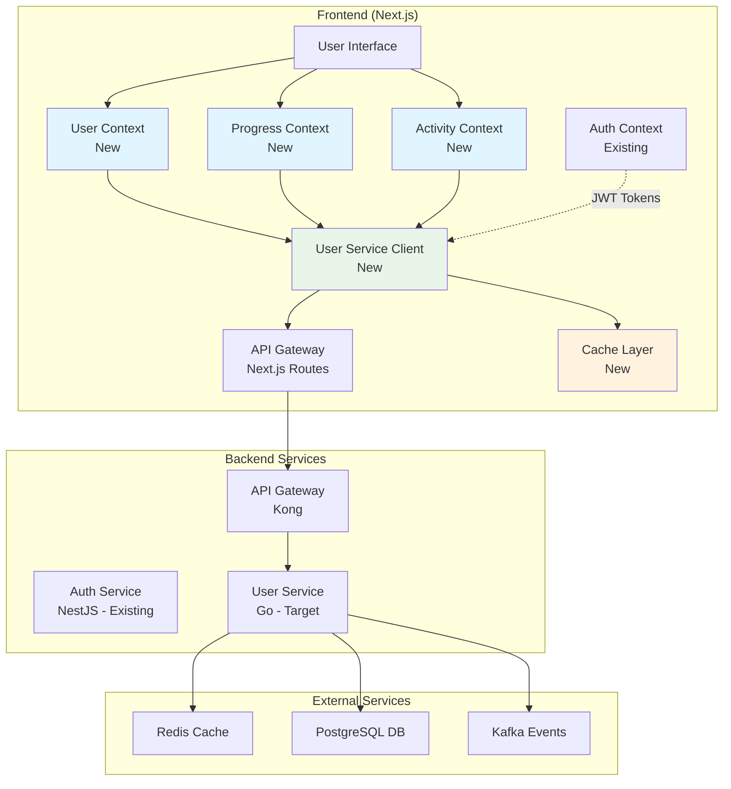
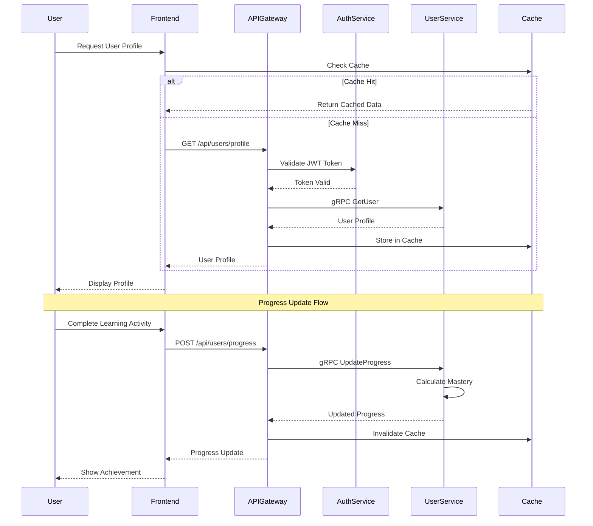

# Design Document

## Overview

This design document outlines the architecture for integrating the Next.js frontend with the Go-based user-service microservice. The integration will provide comprehensive user management, progress tracking, activity monitoring, and GDPR compliance features while leveraging the existing auth-service infrastructure for authentication. The design emphasizes performance optimization, intelligent caching, and graceful degradation to ensure excellent user experience.

## Architecture

### High-Level Architecture



### Service Communication Flow



## Components and Interfaces

### 1. User Service Client Layer

**Purpose**: Centralized communication layer with user-service supporting both HTTP and gRPC protocols.

**Key Features**:
- Protocol selection based on operation type (HTTP for CRUD, gRPC for real-time)
- Automatic JWT token injection from existing auth context
- Request/response transformation and error handling
- Connection pooling and circuit breaker integration
- Correlation ID propagation for distributed tracing

**Interface**:
```typescript
interface UserServiceClient {
  // User Profile Operations
  getUser(userId: string): Promise<UserProfile>
  updateUser(userId: string, updates: UserUpdateRequest): Promise<UserProfile>
  getUserPreferences(userId: string): Promise<UserPreferences>
  updatePreferences(userId: string, preferences: PreferencesUpdateRequest): Promise<UserPreferences>
  deactivateUser(userId: string, reason: string): Promise<void>
  
  // Progress Operations
  getProgressSummary(userId: string): Promise<ProgressSummary>
  getSkillMastery(userId: string, topic?: string): Promise<SkillMastery[]>
  updateSkillMastery(userId: string, topic: string, attempts: AttemptRecord[]): Promise<SkillMastery>
  getLearningStreak(userId: string): Promise<LearningStreak>
  getMilestones(userId: string): Promise<Milestone[]>
  getWeeklyProgress(userId: string, weeks: number): Promise<WeeklyProgressPoint[]>
  
  // Activity Operations
  recordActivity(activity: ActivityRecord): Promise<string>
  recordActivitiesBatch(activities: ActivityRecord[]): Promise<string[]>
  getActivitySummary(userId: string, dateRange: DateRange): Promise<ActivitySummary>
  getEngagementMetrics(userId: string, days: number): Promise<EngagementMetrics>
  generateInsights(userId: string): Promise<ActivityInsight[]>
  generateRecommendations(userId: string): Promise<ActivityRecommendation[]>
  
  // GDPR Operations
  exportUserData(userId: string): Promise<GDPRExportResponse>
  deleteUserData(userId: string): Promise<GDPRDeleteResponse>
  updateConsent(userId: string, consent: ConsentPreferences): Promise<void>
  generatePrivacyReport(userId: string): Promise<PrivacyReport>
  
  // Health and Configuration
  getHealth(): Promise<HealthStatus>
  getServiceInfo(): Promise<ServiceInfo>
}
```

### 2. Multi-Tiered Caching System

**Purpose**: Intelligent caching layer with different strategies for different data types.

**Key Features**:
- Browser-level caching with Service Workers
- Application-level caching with React Query
- API-level caching with Redis integration
- Cache invalidation strategies and optimistic updates
- Cache warming and prefetching

**Interface**:
```typescript
interface CacheManager {
  // Cache Operations
  get<T>(key: string, options?: CacheOptions): Promise<T | null>
  set<T>(key: string, value: T, ttl?: number): Promise<void>
  invalidate(pattern: string): Promise<void>
  invalidateUser(userId: string): Promise<void>
  
  // Cache Strategies
  getUserProfile(userId: string): Promise<UserProfile | null>
  setUserProfile(userId: string, profile: UserProfile): Promise<void>
  getProgressData(userId: string): Promise<ProgressSummary | null>
  setProgressData(userId: string, progress: ProgressSummary): Promise<void>
  
  // Cache Warming
  warmUserCache(userId: string): Promise<void>
  warmDashboardCache(userId: string): Promise<void>
  
  // Optimistic Updates
  optimisticUpdate<T>(key: string, updater: (current: T | null) => T): Promise<void>
  rollbackOptimistic(key: string): Promise<void>
}

interface CacheOptions {
  ttl?: number
  tags?: string[]
  strategy?: 'cache-first' | 'network-first' | 'stale-while-revalidate'
  skipCache?: boolean
}
```

### 3. User Management Context

**Purpose**: React context for managing user profile and preferences state.

**Key Features**:
- Integration with existing auth context
- Optimistic updates for profile changes
- Preference management with validation
- Error handling and recovery
- Cross-tab synchronization

**Interface**:
```typescript
interface UserContextValue {
  // State
  profile: UserProfile | null
  preferences: UserPreferences | null
  isLoading: boolean
  isUpdating: boolean
  error: UserError | null
  
  // Profile Operations
  fetchProfile(): Promise<void>
  updateProfile(updates: Partial<UserProfile>): Promise<void>
  refreshProfile(): Promise<void>
  
  // Preferences Operations
  updatePreferences(preferences: Partial<PreferencesData>): Promise<void>
  resetPreferences(): Promise<void>
  
  // Account Operations
  deactivateAccount(reason: string): Promise<void>
  
  // Utility
  clearError(): void
  isProfileComplete(): boolean
  getDisplayName(): string
}

interface UserProfile {
  id: string
  email: string
  emailVerified: boolean
  countryCode: string
  timezone: string
  language: string
  userRole: string
  mfaEnabled: boolean
  gdprConsent: boolean
  createdAt: Date
  updatedAt: Date
  lastActiveAt: Date
  isActive: boolean
  version: number
}

interface UserPreferences {
  userId: string
  preferences: PreferencesData
  updatedAt: Date
}

interface PreferencesData {
  theme: 'light' | 'dark' | 'system'
  language: string
  notifications: NotificationPreferences
  privacy: PrivacyPreferences
  learning: LearningPreferences
  accessibility: AccessibilityPreferences
}
```

### 4. Progress Tracking System

**Purpose**: Comprehensive progress monitoring and visualization system.

**Key Features**:
- Real-time progress updates via WebSocket
- Skill mastery calculations and trends
- Learning streak tracking
- Milestone and achievement management
- Progress visualization components

**Interface**:
```typescript
interface ProgressContextValue {
  // State
  summary: ProgressSummary | null
  skillMasteries: Map<string, SkillMastery>
  learningStreak: LearningStreak | null
  milestones: Milestone[]
  weeklyProgress: WeeklyProgressPoint[]
  isLoading: boolean
  error: ProgressError | null
  
  // Progress Operations
  fetchProgressSummary(): Promise<void>
  updateProgress(topic: string, attempts: AttemptRecord[]): Promise<void>
  recalculateAllMasteries(): Promise<void>
  
  // Streak Operations
  updateLearningStreak(): Promise<void>
  getStreakHistory(days: number): Promise<StreakPoint[]>
  
  // Milestone Operations
  checkMilestoneAchievements(): Promise<Milestone[]>
  getMilestoneProgress(): Promise<MilestoneProgress[]>
  
  // Analytics
  getProgressTrends(timeRange: TimeRange): Promise<ProgressTrend[]>
  getTopicComparison(topics: string[]): Promise<TopicComparison>
  getPeerComparison(countryCode?: string): Promise<PeerComparison>
  
  // Visualization Data
  getProgressChartData(type: ChartType): Promise<ChartData>
  getMasteryHeatmapData(): Promise<HeatmapData>
  
  // Real-time Updates
  subscribeToProgressUpdates(): void
  unsubscribeFromProgressUpdates(): void
}

interface ProgressSummary {
  userId: string
  overallMastery: number
  totalTopics: number
  masteredTopics: number
  topicMasteries: Record<string, SkillMastery>
  recentAttempts: AttemptRecord[]
  learningStreak: number
  totalStudyTimeMs: number
  totalAttempts: number
  correctAttempts: number
  accuracyRate: number
  weeklyProgress: WeeklyProgressPoint[]
  topicProgress: TopicProgressPoint[]
  milestones: Milestone[]
  recommendations: string[]
  lastActiveDate: Date
  consecutiveDays: number
  generatedAt: Date
}
```

### 5. Activity Monitoring System

**Purpose**: User activity tracking, analysis, and recommendation engine.

**Key Features**:
- Automatic activity recording with batching
- Engagement metrics calculation
- Behavioral pattern analysis
- Personalized insights and recommendations
- Activity visualization and reporting

**Interface**:
```typescript
interface ActivityContextValue {
  // State
  summary: ActivitySummary | null
  engagementMetrics: EngagementMetrics | null
  insights: ActivityInsight[]
  recommendations: ActivityRecommendation[]
  isRecording: boolean
  error: ActivityError | null
  
  // Activity Recording
  recordActivity(activity: Partial<ActivityRecord>): Promise<void>
  recordBatchActivities(activities: Partial<ActivityRecord>[]): Promise<void>
  startSession(sessionData?: SessionData): Promise<string>
  endSession(sessionId: string): Promise<void>
  
  // Analytics
  getActivitySummary(dateRange: DateRange): Promise<ActivitySummary>
  getEngagementMetrics(days: number): Promise<EngagementMetrics>
  getActivityTrends(timeRange: TimeRange): Promise<ActivityTrend[]>
  
  // Insights and Recommendations
  generateInsights(): Promise<ActivityInsight[]>
  generateRecommendations(): Promise<ActivityRecommendation[]>
  applyRecommendation(recommendationId: string): Promise<void>
  
  // Behavioral Analysis
  getBehaviorPatterns(): Promise<BehaviorPattern[]>
  getUsageAnalytics(): Promise<UsageAnalytics>
  
  // Configuration
  updateActivitySettings(settings: ActivitySettings): Promise<void>
  getActivitySettings(): Promise<ActivitySettings>
}

interface ActivityRecord {
  userId: string
  activityType: ActivityType
  sessionId?: string
  itemId?: string
  topicId?: string
  metadata: Record<string, unknown>
  deviceType: string
  appVersion: string
  platform: string
  userAgent: string
  ipAddress: string
  durationMs?: number
  timestamp: Date
}

interface ActivitySummary {
  userId: string
  dateRange: DateRange
  totalActivities: number
  activityBreakdown: Record<ActivityType, number>
  sessionCount: number
  totalSessionTime: number
  averageSessionTime: number
  deviceBreakdown: Record<string, number>
  platformBreakdown: Record<string, number>
  hourlyDistribution: Record<number, number>
  dailyDistribution: Record<string, number>
  topTopics: TopicActivitySummary[]
  engagementMetrics: EngagementMetrics
  behaviorPatterns: BehaviorPattern[]
  generatedAt: Date
}
```

### 6. GDPR Compliance Manager

**Purpose**: Data privacy and compliance management system.

**Key Features**:
- Data export with comprehensive reporting
- Data deletion with confirmation workflows
- Consent management and tracking
- Privacy report generation
- Audit logging for compliance

**Interface**:
```typescript
interface GDPRContextValue {
  // State
  consentStatus: ConsentStatus | null
  exportStatus: ExportStatus | null
  deletionStatus: DeletionStatus | null
  privacyReport: PrivacyReport | null
  isLoading: boolean
  error: GDPRError | null
  
  // Data Export
  requestDataExport(): Promise<string>
  getExportStatus(requestId: string): Promise<ExportStatus>
  downloadExport(requestId: string): Promise<Blob>
  
  // Data Deletion
  requestDataDeletion(reason: string): Promise<string>
  confirmDataDeletion(requestId: string, confirmationCode: string): Promise<void>
  getDeletionStatus(requestId: string): Promise<DeletionStatus>
  
  // Consent Management
  updateConsent(consent: ConsentPreferences): Promise<void>
  getConsentHistory(): Promise<ConsentRecord[]>
  withdrawConsent(consentType: ConsentType): Promise<void>
  
  // Privacy Reports
  generatePrivacyReport(): Promise<PrivacyReport>
  getDataUsageSummary(): Promise<DataUsageSummary>
  
  // Audit and Compliance
  getAuditLog(dateRange: DateRange): Promise<AuditLogEntry[]>
  reportPrivacyIncident(incident: PrivacyIncident): Promise<void>
}

interface ConsentPreferences {
  analytics: boolean
  marketing: boolean
  personalization: boolean
  thirdPartySharing: boolean
  dataRetention: DataRetentionPreference
  communicationChannels: CommunicationPreferences
}

interface PrivacyReport {
  userId: string
  generatedAt: Date
  dataCategories: DataCategoryReport[]
  processingActivities: ProcessingActivity[]
  thirdPartySharing: ThirdPartySharing[]
  retentionPolicies: RetentionPolicy[]
  userRights: UserRightsStatus
  complianceStatus: ComplianceStatus
}
```

## Data Models

### Core User Types

```typescript
// User Profile Types
interface UserProfile {
  id: string
  email: string
  emailVerified: boolean
  countryCode: string
  timezone: string
  language: string
  userRole: 'learner' | 'mentor' | 'admin'
  mfaEnabled: boolean
  gdprConsent: boolean
  createdAt: Date
  updatedAt: Date
  lastActiveAt: Date
  isActive: boolean
  version: number
}

interface UserUpdateRequest {
  timezone?: string
  language?: string
  preferences?: Record<string, unknown>
  gdprConsent?: boolean
  version: number
}

// Progress Types
interface SkillMastery {
  userId: string
  topic: string
  mastery: number // 0.0 to 1.0
  confidence: number // 0.0 to 1.0
  lastPracticed: Date
  practiceCount: number
  correctStreak: number
  longestStreak: number
  totalTimeMs: number
  createdAt: Date
  updatedAt: Date
}

interface AttemptRecord {
  id: string
  userId: string
  itemId: string
  sessionId: string
  selected: Record<string, unknown>
  correct: boolean
  quality?: number
  confidence?: number
  timeTakenMs: number
  hintsUsed: number
  clientAttemptId: string
  deviceType: string
  appVersion: string
  timestamp: Date
  createdAt: Date
}

interface LearningStreak {
  userId: string
  currentStreak: number
  longestStreak: number
  lastActiveDate: Date
  streakStartDate: Date
}

interface Milestone {
  id: string
  type: 'mastery' | 'streak' | 'time' | 'attempts'
  title: string
  description: string
  value: number
  target: number
  achieved: boolean
  achievedAt?: Date
  progress: number // 0.0 to 1.0
}

// Activity Types
interface ActivityRecord {
  userId: string
  activityType: ActivityType
  sessionId?: string
  itemId?: string
  topicId?: string
  metadata: Record<string, unknown>
  deviceType: string
  appVersion: string
  platform: string
  userAgent: string
  ipAddress: string
  durationMs?: number
  timestamp: Date
}

interface EngagementMetrics {
  dailyActiveStreak: number
  weeklyActiveStreak: number
  averageSessionLength: number
  sessionsPerDay: number
  activitiesPerSession: number
  returnRate: number
  engagementScore: number
  churnRisk: 'low' | 'medium' | 'high'
}

interface ActivityInsight {
  id: string
  userId: string
  type: string
  title: string
  description: string
  severity: 'info' | 'warning' | 'critical'
  category: 'engagement' | 'performance' | 'behavior'
  metadata: Record<string, unknown>
  actionItems: string[]
  generatedAt: Date
  expiresAt?: Date
}

interface ActivityRecommendation {
  id: string
  userId: string
  type: string
  title: string
  description: string
  priority: number // 1-10
  category: 'study_schedule' | 'content' | 'strategy'
  metadata: Record<string, unknown>
  actions: RecommendationAction[]
  generatedAt: Date
  expiresAt?: Date
  applied: boolean
  appliedAt?: Date
}
```

### Error Handling Types

```typescript
interface UserServiceError {
  type: 'network' | 'validation' | 'authorization' | 'service' | 'timeout'
  message: string
  code?: string
  details?: Record<string, unknown>
  recoverable: boolean
  retryAfter?: number
  correlationId?: string
}

interface CircuitBreakerState {
  state: 'closed' | 'open' | 'half-open'
  failureCount: number
  lastFailureTime?: Date
  nextAttemptTime?: Date
  successCount: number
}

interface ServiceHealthStatus {
  status: 'healthy' | 'degraded' | 'unhealthy'
  services: {
    database: 'healthy' | 'unhealthy'
    redis: 'healthy' | 'unhealthy'
    kafka: 'healthy' | 'unhealthy'
  }
  responseTime: number
  timestamp: Date
}
```

## Error Handling

### Error Classification and Recovery

1. **Network Errors**: Connection failures, timeouts, DNS issues
   - User Message: "Connection problem. Please check your internet connection."
   - Recovery: Automatic retry with exponential backoff, circuit breaker activation

2. **Validation Errors**: Invalid input data, constraint violations
   - User Message: Field-specific validation messages with correction guidance
   - Recovery: User input correction, form validation feedback

3. **Authorization Errors**: Invalid tokens, insufficient permissions
   - User Message: "Session expired. Please sign in again."
   - Recovery: Token refresh attempt, redirect to login if needed

4. **Service Errors**: User-service internal errors, database issues
   - User Message: "Something went wrong. Please try again later."
   - Recovery: Automatic retry, circuit breaker, graceful degradation

5. **Timeout Errors**: Request timeout, slow responses
   - User Message: "Request is taking longer than expected. Please wait or try again."
   - Recovery: Extended timeout for retry, background processing indication

### Circuit Breaker Implementation

```typescript
interface CircuitBreakerConfig {
  failureThreshold: number // 5 consecutive failures
  recoveryTimeout: number  // 30 seconds
  monitoringPeriod: number // 60 seconds
  halfOpenMaxCalls: number // 3 test calls in half-open state
}

class UserServiceCircuitBreaker {
  private state: 'closed' | 'open' | 'half-open' = 'closed'
  private failureCount = 0
  private successCount = 0
  private lastFailureTime?: Date
  private nextAttemptTime?: Date
  
  async execute<T>(operation: () => Promise<T>): Promise<T> {
    if (this.state === 'open') {
      if (Date.now() < this.nextAttemptTime!.getTime()) {
        throw new UserServiceError({
          type: 'service',
          message: 'User service is temporarily unavailable',
          code: 'CIRCUIT_BREAKER_OPEN',
          recoverable: true,
          retryAfter: Math.ceil((this.nextAttemptTime!.getTime() - Date.now()) / 1000)
        })
      }
      this.state = 'half-open'
      this.successCount = 0
    }
    
    try {
      const result = await operation()
      this.onSuccess()
      return result
    } catch (error) {
      this.onFailure()
      throw error
    }
  }
  
  private onSuccess(): void {
    if (this.state === 'half-open') {
      this.successCount++
      if (this.successCount >= this.config.halfOpenMaxCalls) {
        this.state = 'closed'
        this.failureCount = 0
      }
    } else {
      this.failureCount = 0
      this.state = 'closed'
    }
  }
  
  private onFailure(): void {
    this.failureCount++
    this.lastFailureTime = new Date()
    
    if (this.failureCount >= this.config.failureThreshold) {
      this.state = 'open'
      this.nextAttemptTime = new Date(Date.now() + this.config.recoveryTimeout)
    }
  }
}
```

## Testing Strategy

### Unit Testing

**Service Client Tests**:
- Request/response transformation correctness
- Error handling and classification
- Circuit breaker behavior verification
- Token injection and refresh handling
- Protocol selection logic (HTTP vs gRPC)

**Context Tests**:
- State management and transitions
- Action dispatching and side effects
- Error handling and recovery
- Cache integration and invalidation
- Real-time update handling

**Cache Manager Tests**:
- Cache hit/miss scenarios
- TTL expiration and cleanup
- Optimistic update and rollback
- Cache warming and prefetching
- Cross-tab synchronization

### Integration Testing

**End-to-End User Flows**:
- Complete user profile management cycle
- Progress tracking during learning sessions
- Activity recording and insight generation
- GDPR data export and deletion workflows
- Error scenarios and recovery paths

**Service Integration Tests**:
- Authentication flow with user-service
- Real-time progress updates via WebSocket
- Batch activity recording performance
- Cache invalidation across operations
- Circuit breaker activation and recovery

### Performance Testing

**Load Testing Scenarios**:
- Concurrent user profile requests
- Batch activity recording under load
- Real-time progress update scalability
- Cache performance under high traffic
- Circuit breaker behavior under failure conditions

**Performance Metrics**:
- API response times (P50, P95, P99)
- Cache hit ratios and effectiveness
- WebSocket connection stability
- Memory usage and garbage collection
- Bundle size impact measurement

## Security Considerations

### Authentication and Authorization

1. **JWT Token Security**: Reuse existing auth-service tokens with proper validation
2. **Request Signing**: HMAC signatures for sensitive operations
3. **Rate Limiting**: Client-side request throttling and server-side limits
4. **Input Validation**: Comprehensive sanitization and validation
5. **CORS Configuration**: Strict origin policies for user-service communication

### Data Protection

1. **Encryption in Transit**: HTTPS/TLS for all communications
2. **Sensitive Data Handling**: No sensitive data in logs or client storage
3. **GDPR Compliance**: Proper consent management and data handling
4. **Audit Logging**: Comprehensive activity logging for compliance
5. **Data Minimization**: Only collect and store necessary user data

### Privacy and Compliance

1. **Consent Management**: Granular consent tracking and enforcement
2. **Data Retention**: Automated cleanup based on retention policies
3. **Right to be Forgotten**: Complete data deletion capabilities
4. **Data Portability**: Comprehensive data export functionality
5. **Privacy by Design**: Default privacy-preserving configurations

## Performance Optimization

### Caching Strategy

1. **Browser Cache**: Static assets and rarely-changing data (24 hours)
2. **Application Cache**: User profiles and preferences (5-15 minutes)
3. **API Cache**: Computed progress summaries (1-5 minutes)
4. **Real-time Cache**: Activity data (30 seconds)
5. **Prefetch Cache**: Predictive data loading based on user patterns

### Request Optimization

1. **Request Batching**: Combine multiple operations into single calls
2. **Request Deduplication**: Prevent duplicate simultaneous requests
3. **Connection Pooling**: Reuse HTTP connections for efficiency
4. **Compression**: Request/response compression for large payloads
5. **Protocol Selection**: HTTP for CRUD, gRPC for real-time operations

### Real-time Optimization

1. **WebSocket Management**: Efficient connection pooling and reconnection
2. **Selective Subscriptions**: Subscribe only to relevant data streams
3. **Update Batching**: Batch real-time updates to prevent UI thrashing
4. **Conflict Resolution**: Handle concurrent updates gracefully
5. **Offline Support**: Queue updates during connectivity issues

### Bundle Optimization

1. **Code Splitting**: Separate user-service integration into async chunks
2. **Tree Shaking**: Remove unused user-service client methods
3. **Dynamic Imports**: Load user-service features on demand
4. **Bundle Analysis**: Monitor integration impact on bundle size
5. **Performance Budgets**: Maintain strict size limits for integration code